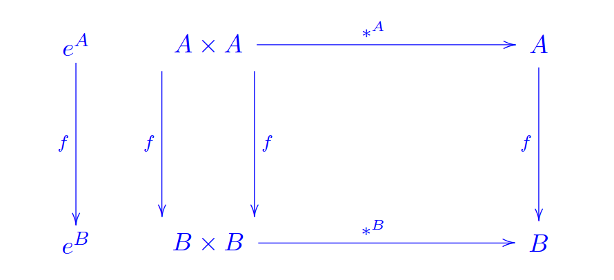

# Vorlesung am 05.11.2021
*Achtung: Teile der Mengenlehre aus M1 nicht hier aufgelistet*  

## Operationen
$n$-stellige Funktion auf $A$: Funktion $f: A^n \rightarrow B$  
$n$-stellige Operation auf $A$: Funktion $f: A^n \rightarrow A$  

- Addition/Multiplikation 2-stellige Operationen auf $\mathbb{N, Z, Q, R}$.
  Division ebenfalls; auf $\mathbb{Q} \setminus \{0\}$ und
  $\mathbb{R} \setminus \{0\}$
- Konkatenation $\cdot$ oder $*$ auf $\Sigma*$

## Eigenschaften von zweistelligen Operationen
- Assoziativität: $(a * b) * c = a * (b * c)$ für alle $a,b,c \in A$
- Kommutativität: $a * b = b * a$ für alle $a,b \in A$
- Neutrales Element $e \in A$: $a * e = e * a = a$ für alle $a \in A$
- Inverses Element (falls neutral): $a' \in A$ zu $a \in A$:
  $a * a' = a' * a = e$

### Beispiel
Konkatenation auf $\Sigma*$ ist assoziativ (aber nicht kommutativ), hat
$\varepsilon$ als neutrales Element, aber für $w \not= \varepsilon$ kein
inverses Element.

## Strukturen
Struktur: Tupel basierend aus einer Trägermenge $M$ und Konstanten, Operationen
und Relationen

### Beispiele
- Strukturen der Algebra: Gruppen ($\mathbb{Z},0,+$),
  Ringe ($\mathbb{Z},0,1,+,\cdot$), Körper ($\mathbb{Q},0,1,+,\cdot$),
  geordnete Körper ($\mathbb{R},0,1,+,\cdot,<$)
- Graphen ($V, E$) mit Knotenmenge $V$ und Kantenmenge $E$
- Monoide (assoziative 2-stellige Operation mit neutralem Element,
  zB. $(\mathbb{N},0,+)$)

### Boolesche Algebren
$(B,0,1,+,\cdot,')$

- BA1: $+$ und $\cdot$ assoziativ und kommutativ
- BA2: $+$ und $\cdot$ distributiv: $x \cdot (y + z) = (x \cdot y) + (x \cdot z)$
- BA3: 0 und 1 neutrale Elemente bzgl. $+$ und $\cdot$ : $x + 0 = x$, $x \cdot 1 = x$
- BA4: Komplement: $0 \not= 1$, $x \cdot x' = 0$, $x + x' = 1$

## Homomorphismen zwischen Strukturen
Strukturerhaltende Abbildung $f$ zwischen Strukturen gleichen Typs mit je einer
zweistelligen Operation und Relation und einer Konstanten:  
$f: A \to B$, $a \mapsto f(a)$

ist ein Homomorphismus, wenn:  
i) $f(e^A) = e^B$  
ii) $f(a_1 *^Aa_2) = f(a_1) *^B f(a_2)$  
iii) $(a_1,a_2) \in R^A \implies (f(a_1),f(a_2)) \in R^B$

### Beispiele
1) $f: \Sigma* \to \mathbb{N}$  
   $w \mapsto |w|$  
   Homomorphismus von $(\Sigma*,\varepsilon,\cdot)$ nach $(\mathbb{N},0,+)$

2) Sei $a \in \Sigma$  
  $f: \mathbb{N} \to \Sigma*$  
  $n \mapsto aaa...a$ ($n$ times)  
  Homomorphismus von $(\mathbb{N},0,+)$ nach $(\Sigma*,\varepsilon,\cdot)$

3) Sei $f: \Sigma_1 \to \Sigma_2$ eine Abbildung zwischen Alphabeten, dann
   genau ein HM: 
   $g: (\Sigma_1*,\varepsilon,\cdot) \to (\Sigma_2*,\varepsilon,\cdot)$

## Isomorphismen
Bijektiver Homomorphismus ($f: A \to B$ gibt also auch $f^{-1}: B\ to A$)  
Wenn vorhanden, heißen $A$ und $B$ *isomorph*.  
Zeichen: $A \simeq B$ ($\LaTeX$: `\simeq`)

### Beispiele
Beispiele 1 und 2 oben dann Isomorphismen, wenn $\Sigma = \{a\}$
(Nur ein Buchstabe)  
3 Isom., wenn $\Sigma_1$ und $\Sigma_2$ gleich viele Elemente und $f$ bijektiv

Homomorphismen $A \to A$ auch Endomorphismen bzw. Automorphismen genannt.
