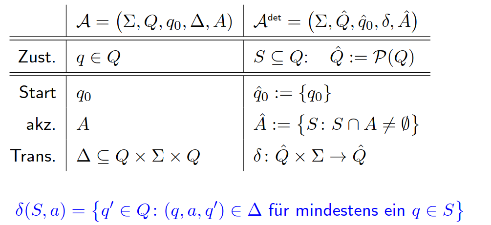

# Vorlesung am 26.11.2021
## Reduktion NFA -> DFA
"Determinisierung"  
**Potenzmengen-Trick**: Zu NFA $\mathcal{A} \space$, DFA $\mathcal{A}^{det}$:  
$L(\mathcal{A}) = L(\mathcal{A}^{det})$

Zustände von $\mathcal{A}^{det}$ sind die Mengen der möglichen Zustände von $\mathcal{A}$.

Wieso dann NFA? Weniger Zustände, einfacher

## Abschlusseigenschaften für NFA/DFA Sprachen
- Vereinigung: Zu DFA $\mathcal{A}_1, \mathcal{A}_2$ existiert $L(\mathcal{A}) = L(\mathcal{A}_1) \cup L(\mathcal{A}_2)$
- Durchschnitt: Zu DFA $\mathcal{A}_1, \mathcal{A}_2$ existiert $L(\mathcal{A}) = L(\mathcal{A}_1) \cap L(\mathcal{A}_2)$
- Komplement: Zu DFA $\mathcal{A}_1$ existiert $L(\mathcal{A}) = \overline{L(\mathcal{A}_1)}$
- Konkatenation: Zu NFA $\mathcal{A}_1, \mathcal{A}_2$ existiert $L(\mathcal{A}) = L(\mathcal{A}_1) \cdot L(\mathcal{A}_2)$ (Mit Reduktion auch für DFA)
- Stern-Operation: Zu NFA $\mathcal{A}_1$ existiert $L(\mathcal{A}) = (L(\mathcal{A}_1))^*$

**Bei folgenden Segmenten gilt:**  
$\mathcal{A}_1 = (\Sigma, Q^1,q_0^1,\delta^1,A^1)$   
$\mathcal{A}_2 = (\Sigma, Q^2,q_0^2,\delta^2,A^2)$  
$\mathcal{A} = (\Sigma, Q,q_0,\delta,A)$   

### Vereinigung und Durchschnitt DFA
$Q := Q^1 \times Q^2$  
$q_0 := (q_0^1,q_0^2)$  
$\delta((q_1,q_2),a) := (\delta^1(q_1,a),\delta^2(q_2,a))$

Durchschnitt: $A := A^1 \times A^2$  
Vereinigung: $A := (A^1 \times Q^2) \cup (Q^1 \times A^2)$

### Komplement DFA
$L(\mathcal{A}_1) = \overline{L(\mathcal{A})}$, wenn  
$\mathcal{A}_1 := (\Sigma, Q, q_0, \delta, Q \setminus A)$

### Konkatenation NFA
$Q := Q^1 \cup Q^2$  
$q_0 := q_0^1$  
$A := A^2$  

$\Delta := \Delta^1 \cup \Delta^2 \cup \Delta^{1 \to 2}$  
($\Delta^{1 \to 2} := \{(q,a,q_0^2): q \in Q^1, (q,a,q') \in \Delta^1 \space \text{für ein} \space q' \in A^1 \}$)

### Sternoperation NFA
$\mathcal{A}^* := (\Sigma,Q,q_0,\Delta^*,A)$, wo  
$\Delta^* := \Delta \cup \{(q,a,q_0^2): q \in Q, (q,a,q') \in \Delta^1 \space \text{für ein} \space q' \in A \}$

Falls $q_0 \in A$: $L(\mathcal{A}^*) = L(\mathcal{A})^*$  
Sonst $L(\mathcal{A}^*) = L(\mathcal{A})^* \setminus \{\varepsilon\}$

## Theorem Reguläre Sprachen
Theorem: Sei $L$ eine reguläre Sprache. Dann wird $L$ von einem geeigneten DFA erkannt.

Beweis: Durch Induktion über reguläre Ausdrücke zeigt:  
$(\forall \alpha \in REG(\Sigma)) (L(\alpha)$ Automaten-erkennbar $)$.  

Induktionsanfang: $\alpha = \emptyset$ und $\alpha = a$ für $a \in \Sigma$.  
$L(\emptyset) = \emptyset$ und $L(a) = \{a\}$ Automaten-erkennbar.

Induktionsschritte: von $\alpha_1, \alpha_2$ zu $\alpha_1 + \alpha_2, \alpha_1 \alpha_2, \alpha_1^*:  
Wenn $L(\alpha_1),L(\alpha_2)$ Automaten-erkennbar sind, so auch  
$L(\alpha_1 + \alpha_2) = L(\alpha_1 ) \cup L(\alpha_2), L(\alpha_1 \alpha_2) = L(\alpha_1) \cdot L(\alpha_2)$,  
$L(\alpha_1^*) = (L(\alpha_1 ))^*$. Dies aber haben wir bereits bewiesen.