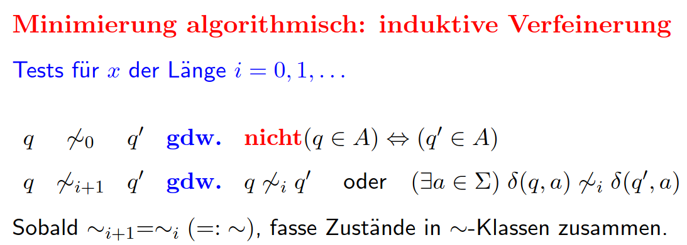

# Vorlesung am 10.12.2021
## Äquivalenzautomat
$L$-Äquivalenzklassenautomat ist bis auf Isomorphie der einzige DFA, der $L$
mit $index(\sim L)$-vielen, d.h. mit minimal vielen, Zuständen erkennt

Definition: Isomorphismus zwischen DFAs  
$A^{(1)} = (\Sigma, Q^{(1)}, q^{(1)}_0 , \delta^{(1)}, A^{(1)})$  
$A^{(2)} = (\Sigma, Q^{(2)}, q^{(2)}_0 , \delta^{(2)}, A^{(2)})$  
ist eine Bijektion $f: Q^{(1)} \to Q^{(2)}$ mit  
1) $f(q^{(1)}_0) = q^{(2)}_0$  
2) $f(\delta^{(1)}(q, a)) = \delta^{(2)}(f(q), a)$ für alle $q \in Q^{(1)},
   a \in \Sigma$  
3) $f[A^{(1)}] = A^{(2)}$

Jeder DFA mit minimal vielen Zuständen, der $L$ erkennt, ist zum
Äquivalenzklassen-Automat $\sim_L$ isomorph.

## Minimierung DFA
- Eliminierung nicht erreichbarer Zustände
- $q \not\sim q$ wesentlich verschieden, wenn für ein $x \in \Sigma∗$ nicht
  $(\hat \delta(q, x) \in A) \leftrightarrow (\hat \delta(q', x) \in A)$
- Zusammenfassen von $\sim$-Klassen

## Pumping Lemma
$L \subseteq \Sigma∗$ ist regulär. Dann existiert ein $n \in \mathbb{N}$, sodass
sich jedes $x \in L$ mit $|x| \ge n$ zerlegen lässt in
$x = uvw, v \not= \epsilon, |uv| \le n$ und für alle $m \in \mathbb{N}$:  
$u \cdot v^m \cdot w = u \cdot v \cdot\cdot\cdot v \cdot w \in L$
($v \cdot\cdot\cdot v$: $m$ mal)
