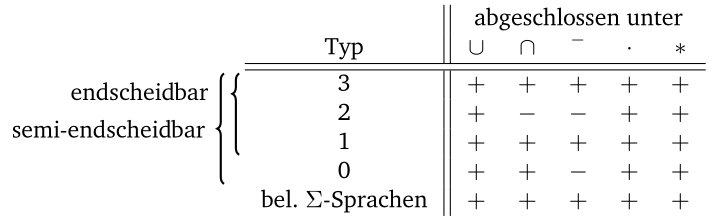
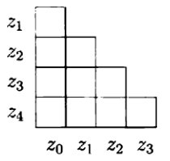
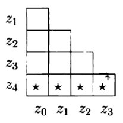
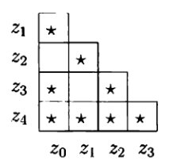

# Notizen für die Klausur
*Diese Notizen habe ich für die Klausur geschrieben. Sie wurden erst hinterher veröffentlicht.*

## Transitionssysteme
- Darstellung durch Zustände $Q$ und mögliche Übergänge
- zB Wecker: $Q = (h, m, mode)$ und Übergänge $seth, setm, +, -$
- Kann auch als Diagramm dargestellt werden (Zustände als Knoten, Übergang als Verbindung)

## Relationen
- reflexiv: $\forall x: x R x$  
- symmetrisch: $\forall x,y: x R y <=> y R x$  
- transitiv: $\forall x,y,z: x R y \implies (y R z \implies x R z)$   
- antisymmetrisch: $x R y \land y R x \implies x = y$

- Surjektivität: $\forall y \in B: \exists x \in A: f(x) = y$  
  "Zu jedem $y$ in der Zielmenge gibt es mindestens 1 $x$ im Definitionsbereich"
- Injektivität: $\forall x,y \in A: f(x) = f(y)$; $x = y$  
  "Zu jedem $y$ und $x$ im Definitionsbereich steht nur ein $x$ zu einem $y$."  
  $\implies$ "Jedes $y$ hat höchstens 1 $x$"
- Bijektivität: surjektiv und injektiv

## Induktion
Beispiel an "$6|(n^3 - n)$ immer gerade":  
Beweis: Induktion nach $n$ mit $A(n) :\equiv 6|(n^3 - n)$  
Induktionsanfang: Sei $n = 0$; $6|0$ wahr.  
Induktionsschritt: Sei $n \in \mathbb{N}$ beliebig.  
Induktionsannahme: $6|(n^3-n)$ gilt  
Zu zeigen: $6|((n + 1)^3 - (n + 1))$ (nicht hier gelistet; ist wahr.)

## Abschlusseigenschaften

## Reguläre Sprachen
Die regulären Sprachen werden ausgehend von den Sprachen $\emptyset$ und $\{a\}$ durch die Operationen Vereinigung, Konkatenation und Stern erzeugt.  
Beispiel regulärer Ausdruck: $0*(1|2)0*$ ("Beliebig viele 0 und mindestens eine 1 ODER 2")

### DFA
$\mathcal{A} = (\Sigma, Q, q_0, \delta, A)$

- Zustandsmenge $Q$ (endlich, nicht leer)
- Anfangszustand $q_0 \in Q$ 
- Menge $A \subseteq Q$ akzeptierter Zustände
- Übergangsfunktion $\delta: Q \times \Sigma \to Q$
- Akzeptiert, wenn Endzustand in $A$
- Kann alle regulären Sprachen erkennen

### NFA
$\mathcal{A} = (\Sigma, Q, q_0, \Delta, A)$

- Zustandsmenge $Q$ (endlich, nicht leer)
- Anfangszustand $q_0 \in Q$ 
- Menge $A \subseteq Q$ akzeptierter Zustände
- Übergangs**relation** $\Delta \subseteq Q \times \Sigma \times Q$
- Akzeptiert, wenn einer der möglichen Abläufe Endzustand in $A$ hat

Umwandlung zu DFA: $Q_{DFA} = P(Q_{NFA})$ ("Potenzmengentrick")

### Satz von Myhill-Nerode
- Ä.Relation: $w \sim_L v$ wenn $(\forall x \in \Sigma*) (wx \in L \iff v x \in L)$
- $\sim_L$ hat endlichen Index $\iff$ $L$ regulär
- Für reguläres $L$: minimaler DFA ("Äquivalenzklassen-Automat") mit genau $index(\sim_L)$ Zuständen.
  Pro Klasse ein Zustand
- Jeder DFA mit minimal vielen Zuständen, der $L$ erkennt, ist zum Äquivalenzklassen-Automat
isomorph.

### Minimierung DFA
Beispiel mit DFA: $Q = \{z_1, z_2, z_3, z_4\}$, $A = \{z_4\}$  
Erstellen einer Tabelle mit allen Zuständen:

Alle Paare von akzeptierten und nicht akzeptierten Zuständen markieren:

Für jedes noch unmarkierte Paar und jedes $a \in \Sigma$ teste, ob $\{\delta(z, a), \delta(z', a)\}$
bereits markiert ist. Wenn ja: markiere auch $\{z, z'\}$.  
Wiederhole, bis sich keine Änderung mehr ergibt.

Alle jetzt noch unmarkierten Paare können jeweils zu einem Zustand verschmolzen werden.  
Hier: $z_0,z_2$ und $z_1,z_3$ können verschmolzen werden.

Quelle: Schoening U. - Theoretische Informatik kurz gefasst

### Pumping-Lemma
Bei reguläre Sprache $L$: Es gibt eine Zahl $n$, sodass
sich alle Wörter $x \in L$ mit $|x| > n$ zerlegen lassen in $x = uvw$,
mit folgenden Eigenschaften:

1. $|v| \ge 1$
2. $|uv| < n$
3. Für alle $i = 0,1,2,...$: $uv^iw \in L$.

Dies gilt auch für manche nicht reguläre Sprachen; vorallem nützlich, um
zu zeigen, dass $L$ *nicht* regulär ist (Da eine Regel verletzt wird).

## Entscheidungsprobleme
### Wortproblem
$L \subseteq \Sigma*$: Entscheide, ob beliebiges $w$ in $L$.  
Entscheidbar für reguläres $L$, da $L$ durch einen DFA erkannt wird; (lineares) Entscheidungsverfahren.  
Entscheidbar für kontextfreies $L$ mit CYK-Alg.

### Leerheitsproblem
DFA $A$: Ob $L(A) = \emptyset$  
Entscheidbar: Zustandsgraph untersuchen; kann akzeptierter Zustand erreicht werden?

### Sprachgleichheit
Bei DFAs $A, B$: Ob $L(A) = L(B)$
Ist entscheidbar.

## Grammatiken
Bestehend aus Liste von Produktionsregeln

Beispiel:  
$S \to AB | ASB$  
$A \to a$  
$B \to b$  

### Chomsky-Hierachie
- Typ 0 (allgemein): Keine Einschränkungen
- Typ 1 (kontextsensitiv): Linke Seite ist gleich lang oder kleiner als rechte (Regeln können die Produktion nicht verkürzen)
- Typ 2 (kontextfrei): Linke Seite ist immer genau eine Variable
- Typ 3 (regulär): Regeln sind "rechtslinear", dh. immer $X \to \varepsilon$, $X \to a$ oder $X \to aY$

Es gilt: Typ 3 $\subset$ Typ 2 $\subset$ Typ 1 $subset$ Typ 0.

## Kontextfreie Sprachen
### Chomsky-Normalform
KF-Sprache, bei der alle Regeln entweder: $S \to x$ oder $S \to AB$.  
Startzustand $S$ darf nicht in einer anderen Regel vorkommen.  
Erzeugt, in dem Regeln mit mehr als 2 Variablen zu mehreren zerlegt werden.  
Für jedes Terminalsymbol wird eine neue Regel eingeführt, um diese
aus anderen Regeln zu eliminieren.

### Pumping-Lemma
Bei KF-Sprache $L$: Es gibt eine Zahl $n$, sodass
sich alle Wörter $z \in L$ mit $|z| > n$ zerlegen lassen in $x = uvwxy$,
mit folgenden Eigenschaften:

1. $|vx| > 1$
2. $|vwx| < n$
3. Für alle $i > 0$: $uv^iwx^iy \in L$.

### CYK-Alg
Stellt fest, ob $x \in L$. 

### Kellerautomaten (PDA)
$\mathcal{P} = \Sigma, Q, q_0, \Delta, A, \Gamma, \#$:

- Eingabealphabet $\Sigma$
- Kelleralphabet $\Gamma$
- Anfangs-Kellersymbol $\# \in \Gamma$
- Zustandsmenge $Q$
- Anfangszustand $q_0 \in Q$
- Akzeptierende Zustände $A \subseteq Q$
- $\Delta \subseteq Q \times \Gamma \times (\Sigma \cap \{\varepsilon\}) \times \Gamma* \times Q$ Übergangsrelation (endlich!)
- Analog zu DFA: Kann alle kontextfreien Sprachen erkennen

NFA mit "Keller" bzw. Speicher. Zusätzliches Alphabet $\Gamma$ für Keller.
Zustandsübergang hat nur "Zugriff" zu oberstem Element im Keller.  
Konfiguration (aktueller Zustand) bestimmt durch Zustand $q \in Q$, Position
in Eingabe und Kellerinhalt $\alpha \in \Gamma^*$

Übergang ist abhängig von Zustand, oberstem Kellersymbol und nächstem Eingabesymbol.  
Beim Übergang passiert folgendes:

- Zustand $q$ wechselt
- Optional: Vorrücken zum nächsten Eingabesymbol
- Das oberste Symbol aus dem Keller wird entfernt ("pop")  
- Ein oder mehrere Symbole werden auf den Keller geschrieben ("push")

Konfiguration (stellt vollständingen Automatenzustand dar):  
$C = (q, v, \alpha) \in Q \times \Sigma* \times \Gamma*$: Zustand, Restwort, Kellerinhalt  
Startkonfiguration: $C_0[w] = (q_0 , w, \#)$

Wort akzeptiert, wenn bei Endzustand das Restwort und Kellerinhalt $\varepsilon$ entsprechen
und $q \in A$.  
Endzustand ist erreicht, wenn keine möglicher Übergang in der Relation definiert ist.

Beispiel für Übergang:  
(Zustand, Kellerinhalt, Symbol, Keller-Push, Nächster Zustand)  
$(q, |, (, ||, q)$ verarbeitet “(” und addiert “|” im Keller  
$(q, |, ), \varepsilon, q)$ verarbeitet “)” und löscht ein “|” im Keller  

## Turingmaschinen
DTM: DFA + unbeschränkter Lese/Schreibzugriff auf Speicher: unbeschränkte Folge von Zellen
als “Band” mit Lese/Schreibkopf.  
Entscheidet Wortproblem für Typ-1/0.

DTM $\mathcal{M} = (\Sigma, Q, q_0, \delta, q^+, q^-)$

- Zustandsmenge $Q$
- Anfangszustand $q_0 \in Q$
- Akzeptierender Endzustand $q^+ \in Q$
- Verwerfender Endzustand $q^− \in Q$
- Übergangsfunktion $\delta$

Konfiguration $(\alpha, q, x, \beta)$ bestimmt durch

- Zustand $q \in Q$
- Position auf dem Band $x$
- Bandinhalt ($\alpha$: Links vom Kopf, $\beta$: Rechts vom Kopf)
  
Startkonfiguration: $C_0[w] := (\varepsilon, q_0, ✷, w)$  
Endkonfigurationen: $q \in \{q^+, q^-\}$, akzeptierend/verwerfend.

Übergang in Nachfolgekonfiguration abhängig von Zustand und aktuell gelesenem Bandsymbol.  
Ein Übergang resultiert in

- Zustandswechsel
- Schreiben
- Kopfbewegung ($<, \cdot, >$)

- Wenn $\mathcal{M}$ einen Endzustand bei $w$ erreicht: $w \to STOP$
- Wenn $\mathcal{M}$ keinen Endzustand bei $w$ erreicht: $w \to \infty$ ("divergiert auf $w$")
- Ein DTM über Alphabet $\Sigma$ ist total, wenn es für alle $w \in \Sigma^*$ stoppt.

### Halteproblem
$HP := \{\langle \mathcal{M} \rangle: \mathcal{M} angesetzt auf \langle \mathcal{M} \rangle stoppt\}$.  
$HP$ ist rekursiv aufzählbar, jedoch unentscheidbar.  
$\overline{HP}$ ist nicht rekursiv aufzählbar; Typ-0 damit nicht unter Komplement abgeschlossen.

### Nichtdeterministische Turingmaschinen (NTM)
Analog zu NFA: DTM mit Übergangsrelation $\Delta$ anstatt Funktion $\delta$  
Eigenschaften ähnlich zu NFA: Es gibt immer einen gleichen DTM, jedoch Rechenzeit
exponenziell länger als NTM

Eine NTM heißt linear platzbeschränkt, wenn sich der Lese/Schreibkopf für $w \in \Sigma*$ höchstens
$c \in \mathbb{N}; c \cdot |w|$ vom Start entfernt. Solch ein NTM erkennt genau
kontextsensitive Sprachen (Typ-1).

## Allgemeine Sprachen
- Sprache $L$ heißt rekursiv aufzählbar (semi-entscheidbar, Typ-0), falls es eine DTM gibt, die $L$
akzeptiert.
- Sprache $L$ heißt entscheidbar (rekursiv), falls es eine DTM gibt, die $L$ entscheidet.
  Die DTM akzeptiert dann auch $L$.
- $L$ ist entscheidbar = sowohl $L$ als auch $\overline L$ sind aufzählbar.
- Es gibt von Typ-0 Grammatiken erzeugte Sprachen, deren Wortproblem unentscheidbar ist.

