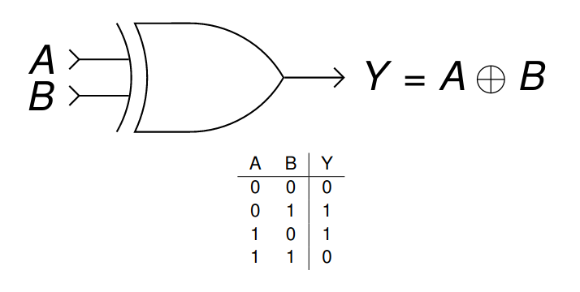
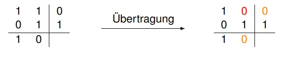
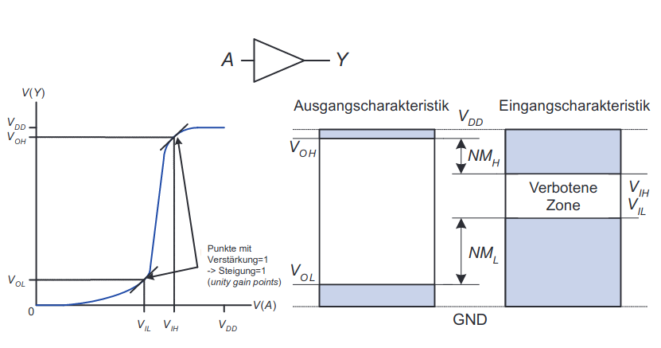
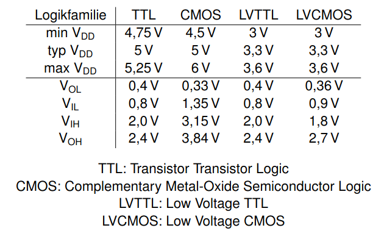
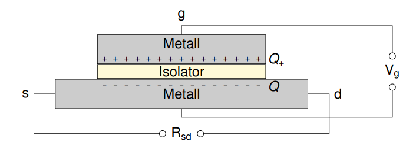
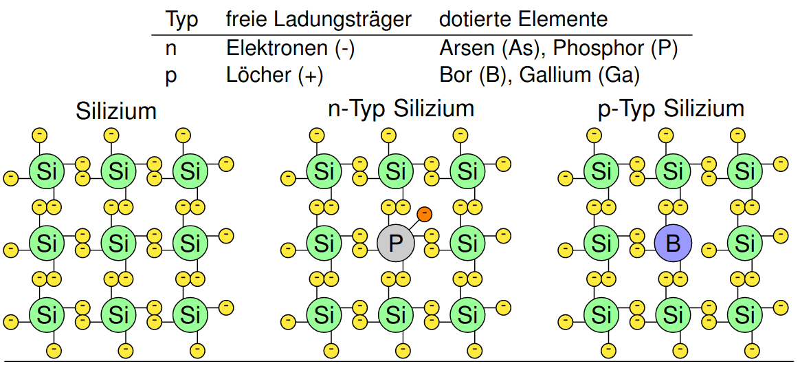
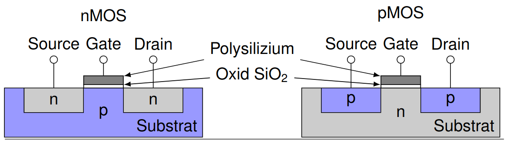
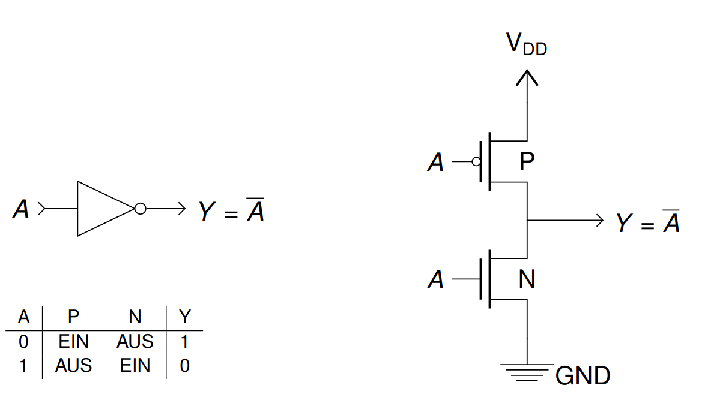
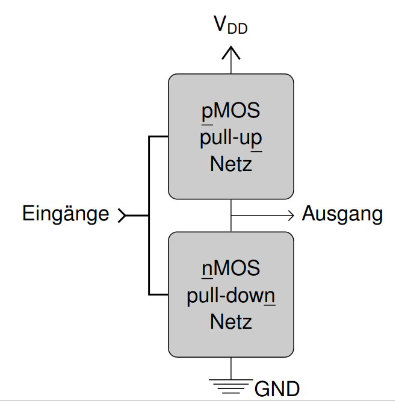
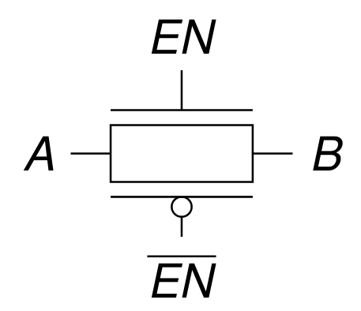

# Vorlesung am 03.11.2021
## XOR-Gatter 

### XOR mit mehreren Eingängen
XOR gibt $(x \% 2) == 1$, wenn $x$ die Anzahl der Eingänge, an denen 1 anliegt,
an.

### Paritätsfunktion
Paritätsfunktion $p : (a_{k-1} ... a_0) \in \mathbb{B}^k \mapsto a_{k-1} \oplus ... \oplus a_0 \in \mathbb{B}$  
- $p(a) = 0 \implies$ Quersumme von $a$ ist gerade
- $p(a) = 1 \implies$ Quersumme von $a$ ist ungerade

### Längs - und Querparität

- Erlaubt Fehlerkorrektur
- Verhältnis Parität/Nutzdaten wird schlechter
- In Praxis oft andere Methoden verwendet

## Physikalische Realisierung von Logikgattern
### Spannungen als Logikpegel
Beispiel:
- $0V \mapsto 0$ (Erde / GND / $V_{SS}$ "Voltage Source Source")
- $5V \mapsto 1$ (Versorgungsspannung, $V_{DD}$ "Voltage Drain Drain")

Wegen Rauschen: Spannungsbereiche notwendig
- $V_{OL}$: größte Spannung, die Treiber als 0 ausgibt ("Voltage Output Low")  
- $V_{IH}$: kleinste Spannung, die Empfänger als 1 interpretiert
  ("Voltage Input High")  
- $V_{OH}$: kleinste Spannung, die Treiber als 1 ausgibt ("Voltage Output High")  
- $V_{IL}$: größte Spannung, die Empfänger als 0 interpretiert
  ("Voltage Input Low")   
- oberer Störabstand $NM_H$ = $V_{OH} − V_{IH}$ ("Noise Margin High")  
- unterer Störabstand $NM_L$ = $V_{IL} − V_{OL}$ ("Noise Margin Low")

- Spannung über Jahrzehnte abgesenkt; ermöglicht kleinere Transistoren und
  weniger Stromverbrauch

## Feldeffekt-Transistoren
- Spannungsgesteuerte Schalter mit Source s, Drain d, Gate g

### Feldeffekt

- Bildet Plattenkondensator
- Spannung $V_g$ lädt diesen auf; beeinflusst Menge der freien Leistungsträger
- Wird durch Halbleiter nutzbar

### Silizium-basierte Halbleiter
- reines Silizium ist schlechter Leiter (keine freien Ladungsträger)  
- Dotierung ermöglicht gezieltes einbringen freier Ladungsträger

### Diode
- Übergang p/n-Silizium
- Vorwärtsspannung: $V_A > V_C + V_{th}$ (Stromfluss A $\rightarrow$ K)
- Sperrspannung: $V_A < V_C + V_{th}$ (Kein Fluss)

### Metalloxid-Halbleiter (MOS)-FETs
- Undotiertes Silizium (früher Metallschicht) für Gate
- Oxid (Siliziumdioxid = Glas) für Isolator
- Dotiertes Silizium für Substrat und Anschlüsse (Source, Drain)

- nMOS: Gate = 0 $\rightarrow$ ausgeschaltet  
  - Majoritätsladungsträger sind Elektronen
  - Leiten 0'en gut weiter
- pMOS: Gate = 0 $\rightarrow$ eingeschaltet  
  - Majoritätsladungsträger sind Löcher
  - Leiten 1'en gut weiter

## CMOS (Complementary Metal-Oxide-Semiconductor)
- pMOS Source an $V_{DD}$
- nMOS Source an GND

### CMOS-Gatter: NOT

### Allgemeiner Aufbau eines CMOS-Gatters

### Pseudo-nMOS Gatter
- Ersetzen des Pull-Up Netzes durch schwachen, immer eingeschalteten pMOS
  -  Pull-Up kann durch das Pull-Down Netz “überstimmt” werden
- Spart Transistoren
- Verbraucht mehr Energie: schwacher Kurzschluss bei dem pMOS-FET

### Transmissionsgatter
- Transmissionsgatter ist besserer Schalter: leitet 0'en und 1'en gut weiter

## Leistungsaufnahme
### Statische Leistungsaufnahme
- Bedarf, wenn kein Gatter schaltet
- Durch Leckstrom $I_{DD}$
  - Kleinere Transistoren schalten nicht vollständig ab
  - Pseudo-nMOS, ...
- $P_{static} = I_{DD} · V_{DD}$

### Dynamische Leistungsaufnahme
- Aufladen Gate-Kapazität $C$ von 0 auf $Q = C · V_{DD}$
- Transistoren schalten $f$-mal pro Sekunde (Frequenz)
  - $I = \frac Q t = Q · \frac f 2 = C · V_{DD} · \frac f 2$
- $P_{dynamic} = I · V = (C · V_{DD} · \frac f 2)(V_{DD}) = \frac 1 2 C · {V_{DD}}^2 · f$

### Beispiel: Leistungsaufnahme Netbook-CPU
$V_{DD} = 1.2V$  
$f = 1\text{GHz}$  
$C = 20\text{nF}$  
$I_{DD} = 20\text{mA}$

$P = P_{static} + P_{dynamic}$  
$P = I_{DD} · V_{DD} + \frac 1 2 · C · {V_{DD}}^2 · f$  
$P = 24\text{mW} + 14.4\text{mW}$

### Moore'sches Gesetz
- Gordon Moore, *1929
- Moore'sches Gesetz: Alle 18 Monate verdoppelt sich die Anzahl
  der Transistoren auf einem Chip.
    - Seit einigen Jahren nicht mehr anwendbar (ca. 2008)
