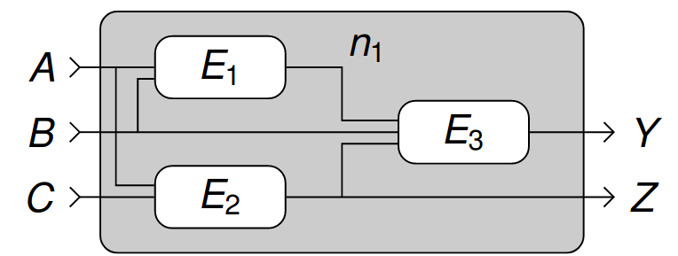

# Vorlesung am 10.11.2021
## Abstrakte Eigenschaften logischer Schaltungen
- Eingänge & Ausgänge  
- Funktionales Verhalten (boolesche Funktion)
- Zeitverhalten

### Komponenten einer Schaltung
Verbindungsknoten:  
Eingangsterminale $A, B, C$, Ausgangsterminale $Y, Z$, interne Knoten  $n_1$

Schaltungselemente:  
$E_1, E_2, E_3$  
Bildet Hierarchie, da jedes Element selbst Schaltung

### Arten von logischen Schaltungen
- Kombinatorische Logik ("Schaltnetz"): Ausgänge hängen nur von aktuellen
  Eingangswerten ab
- Sequentielle Logik ("Schaltwerk"): Auch abhängig von internem Zustand
  (vorherigen Werten)

### Eigenschaften kombinatorischer Logik
- Jedes Schaltungselement ist selbst kombinatorisch
- Jeder Knoten entweder Eingang oder an genau ein Ausgangsterminal
- Jeder Pfad besucht jeden Knoten maximal einmal (zyklenfrei)

## Boolesche Gleichungen
Operatorpräzedenz: NOT, AND, XOR, OR

Beispiel: Volladdierer  
$S = F_1: (A, B, C_{in}) \in \mathbb{B}^3 \mapsto \mathbb{B} = A \oplus B \oplus C_{in}$  
$C_{out} = F_1: (A, B, C_{in}) \in \mathbb{B}^3 \mapsto \mathbb{B} = A B + A C_{in} + B C_{in}$  

### Begriffe
| Begriff    | Bedeutung                                                       |
| ---------- | --------------------------------------------------------------- |
| Komplement | Invertierte Variable ($\overline A$)                            |
| Literal    | Variable oder Komplement                                        |
| Implikant  | Produkt von Literalen ($ABC, \overline {AC}$)                   |
| Minterm    | Konjunktion über alle Eingangsvariablen  ($ABC, AB\overline C$) |
| Maxterm    | Disjunktion über alle Eingangsvariablen  ($A + B + C$)          |

## Minterm
- Produkt, dass alle Eingangsvariablen genau einmal enthält
- Jeder Minterm für genau eine Eingangskombination wahr

### Disjunktive Normalform
- Summe aller Minterme, für die die Funktion wahr ist
- Beispiel XOR: $Y = m_{01} + m_{10} = \overline AB + A \overline B$

## Maxterm
- Summe, dass alle Eingangsvariablen genau einmal enthält
- Jeder Minterm für genau eine Eingangskombination falsch

### Konjunktive Normalform
- Produkt aller Maxterme, für die die Funktion falsch ist
- Beispiel XOR:
  $Y = m_{01} + m_{10} = (A + B) \space (\overline A + \overline B)$

## Boolesche Algebra
- Axiome: Grundliegende unbeweisbaren Annahmen
- Theoreme: Komplexere Regeln aus Axiomen, die beweisbar sind
- Durch Begrenzung auf $\mathbb{B}$ ergänzt/optimiert

### Axiome
| Axiom (A1)                      | Duales Axiom (A1')          | Bedeutung  |
| ------------------------------- | --------------------------- | ---------- |
| A1: $B \not= 1 \implies B = 0$  | $B \not= 0 \implies B = 1$  | Dualität   |
| A2: $\overline 0 = 1$           | $\overline 1 = 0$           | Negieren   |
| A3: $0 \cdot 0 = 0$             | $1 \cdot 1 = 1$             | Und / Oder |
| A4: $1 \cdot 1 = 1$             | $0 \cdot 0 = 0$             | Und / Oder |
| A5: $0 \cdot 1 = 1 \cdot 0 = 0$ | $1 \cdot 0 = 0 \cdot 1 = 1$ | Und / Oder |

### Theoreme
| Theorem                                                                    | Duales Theorem                                                              | Bedeutung       |
| -------------------------------------------------------------------------- | --------------------------------------------------------------------------- | --------------- |
| T1 $A ·1 = A$                                                              | T1’ $A + 0 = A$                                                             | Neutralität     |
| T2 $A ·0 = 0$                                                              | T2’ $A + 1 = 1$                                                             | Extremum        |
| T3 $A ·A = A$                                                              | T3’ $A + A = A$                                                             | Idempotenz      |
| T4 $\overline{\overline{A}} = A$                                           |                                                                             | Involution      |
| T5 $A · \overline A = 0$                                                   | T5’ $A + \overline A = 1$                                                   | Komplement      |
| T6 $A ·B = B ·A$                                                           | T6’ $A + B = B + A$                                                         | Kommutativität  |
| T7 $A ·(B ·C) = (A ·B) ·C$                                                 | T7’ $A + (B + C) = (A + B) + C$                                             | Assoziativität  |
| T8 $A ·(B + C) = (A ·B) + (A ·C)$                                          | T8’ $A + (B ·C) = (A + B) ·(A + C)$                                         | Distributivität |
| T9 $A ·(A + B) = A$                                                        | T9’ $A + (A ·B) = A$                                                        | Absorption      |
| T10 $(A ·B) + (A · \overline B) = A$                                       | T10’ $(A + B) ·(A + \overline B) = A$                                       | Zusammenfassen  |
| T11 $(A ·B) + (\overline A ·C) + (B ·C) = (A ·B) + (\overline A ·C)$       | T11’ $(A + B) ·(\overline A + C) ·(B + C) = (A + B) ·(\overline A + C)$     | Konsensus       |
| T12 $\overline{A ·B ·C} ... = \overline A + \overline B + \overline C ...$ | T12’ $\overline{A + B + C} ... = \overline A ·\overline B ·\overline C ...$ | De Morgan       |

### De Morgan'sche Regeln
- Das Komplement des Produkts ist die Summe der Komplemente.
- Das Komplement der Summe ist das Produkt der Komplemente.

## Beweisen von Theoremen
### Überprüfen aller Möglichkeiten
Beweis Distributivität (T8):

| $A$ | $B$ | $C$ | $B + C$ | $A (B + C)$ | $A B$ | $A C$ | $A B + A C$ |
| --- | --- | --- | ------- | ----------- | ----- | ----- | ----------- |
| 0   | 0   | 0   | 0       | 0           | 0     | 0     | 0           |
| 0   | 0   | 1   | 1       | 0           | 0     | 0     | 0           |
| 0   | 1   | 0   | 1       | 0           | 0     | 0     | 0           |
| 0   | 1   | 1   | 1       | 0           | 0     | 0     | 0           |
| 1   | 0   | 0   | 0       | 0           | 0     | 0     | 0           |
| 1   | 0   | 1   | 1       | 1           | 0     | 1     | 1           |
| 1   | 1   | 0   | 1       | 1           | 1     | 0     | 1           |
| 1   | 1   | 1   | 1       | 1           | 1     | 1     | 1           |

### Beweis durch Anwendung von Axiomen und Theoremen
Beweis Absorption (T9):

| Term                    | Regel           |
| ----------------------- | --------------- |
| $A \cdot (A + B)$       | Distributivität |
| $A \cdot A + A \cdot B$ | Idempotenz      |
| $A + A \cdot B$         | Neutralität     |
| $A \cdot 1 + A \cdot B$ | Distributivität |
| $A \cdot (1 + B)$       | Extremum        |
| $A \cdot 1$             | Neutralität     |
| $A$                     | q.e.d.          |

Konsensus (T11):

| Term                                    | Regel           |
| --------------------------------------- | --------------- |
| $A ·B + A ·C + B ·C$                    | Neutralität     |
| $A ·B + A ·C + 1 ·B ·C$                 | Komplement      |
| $A ·B + A ·C + (A + A) ·B ·C$           | Distributivität |
| $A ·B + A ·C + A ·B ·C + A ·B ·C$       | Kommutativität  |
| $A ·B + A ·B ·C + A ·C + A ·C ·B$       | Neutralität     |
| $A ·B ·1 + A ·B ·C + A ·C ·1 + A ·C ·B$ | Distributivität |
| $A ·B ·(1 + C) + A ·C ·(1 + B)$         | Extremum        |
| $A ·B · 1 + A ·C · 1$                   | Neutralität     |
| $A ·B + A ·C$                           | q.e.d.          |

## Logikminimierung
DNF/KNF kann aufwändig/lang sein, Minimierungsbeispiel mit Axiomen/Theoremen:

\begin{align}
Y &= \overline A \overline B \overline C + \overline A \overline B C
+ A \overline B \overline C + A \overline B C + A B C \\
&= \overline A (\overline B \overline C + \overline B C)
+ A (\overline B \overline C + \overline B C) + A B C \\
&= \overline A (\overline B (\overline C + C))
+ A (\overline B (\overline C + C)) + A B C \\
&= \overline A \overline B + A \overline B + A B C \\
&= (\overline A + A) \overline B + A B C \\
&= \overline B + A B C \\
&= \overline B + A C \\
\end{align}
