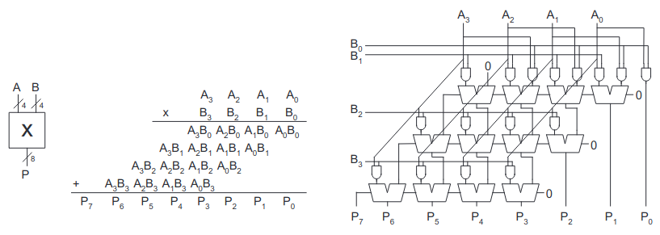
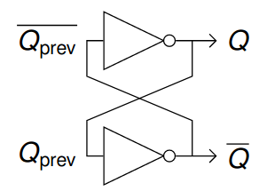

# Vorlesung am 01.12.2021
*Schaltungen ausgelassen.*

## Shifter
- logischer Shift: Auffüllen mit Nullen
- umlaufender Shift: Rotation
- arithmetischer Shift: Auffüllen mit Vorzeichen (rechts), mit 0 (links)

### Arithmetischer Shift als Mul/Div
- Linksshift um $n$ entspricht Multiplikation mit $2^n$
- Rechtsshift um $n$ entspricht Dividierung mit $2^n$

## Addierer
### Halbaddierer (HA)
$A, B \mapsto S, C$  
Keinen Eingang für C

### Volladdierer (VA)
$A, B, C_i \mapsto S, C_0$  
Eingang für C von vorherigem Adder

### Ripple-Carry-Adder (RCA)
$A_{0..3}, B_{0..3} \mapsto S_{0..4}$  
Kette von VA (Carry verbunden), um 4-bit Zahlen zu addieren  
Ergebnis wegen Carry 5-bit breit

Durch Verbinden von 2 RCA Byte-Addition möglich, jedoch langsam da High-RCA warten muss auf Carry von Low-RCA

### Conditional Sum Adder (CSA)
Byte-Adder mit 1x RCA für Low und 2x RCA für High, wobei ein High mit Carry = 0 und ein High mit Carry = 1.  
Wenn Low Carry berechnet hat, wird High durch einen MUX entschieden; somit schneller.

### Carry Lookahead Adder (CLA)
TODO

## Andere Rechenarten
### Subtrahierer
$A - B = A + (- B)$  
$\implies$ Addierer mit NOT an B-Eingängen und $C_0 = 1$

### Kleiner Als
$A < B \iff A - B < 0$  
Somit is Sign in Zweierkomplement $A < B$

### Gleichheit
Bitweise XNOR mit AND

### Multiplikation

## Sequentielle Schaltungen
Ausgänge abhängig von vorherigem Eingang, speichert internen Zustand

### Bistabile Grundschaltung
  
Gespeicherter Zustand kann nicht
beeinflusst werden

### SR-Latch
Latch aus 2x NOR  
Eingang $S$ (Set) und $R$ (Reset)

### JK-Latch
SR mit 2 zusätzlichen AND ($J = S$, $K = R$)
Ungültigen Zustand $SR$ verhindern (Stattdessen Toggle)

### D-Latch
Einen Eingang $D$ und CLK, Zustand $D$ nur an Ausgang übernommen, während $CLK = 1$

### D-Flipflop
2 D-Latches in Serie  
Ausgang übernimmt Wert von $D$ bei steigender Taktflanke (wenn $CLK = 1$)

