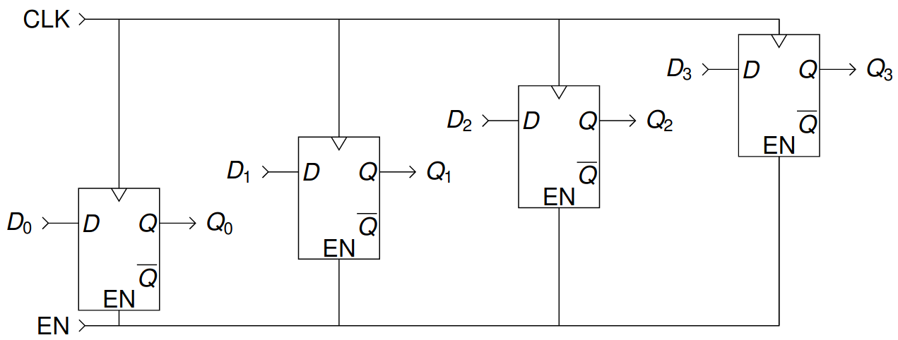
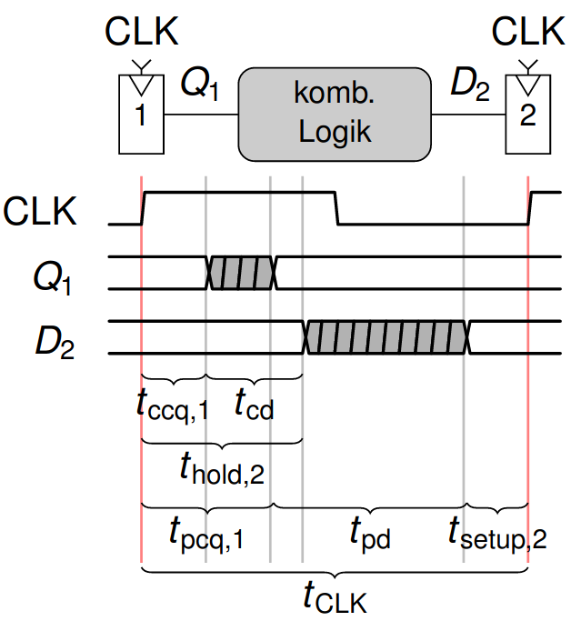

# Vorlesung am 08.12.2021
*Wiederholung von letzter Woche ausgelassen.*

## Flip-Flop-Varianten
### Flip-Flop mit Taktfreigabe
Eingang $EN$. $D$ wird nur bei $EN = 1$ übernommen.  
Beispiel: Shift-Register  

### Zurücksetzbare Flip-Flops: 
Eingang $\text{Reset}$.  
Kann synchron (nur zur Taktflanke wirksam) oder asynchron (immer wirksam) sein

## Synchrone sequentielle Schaltungen
Sequentielle Schaltungen, die durch Taktflanke 'aufgebrochen' werden und somit
stabil sind, gesamte Schaltung *synchronisiert* mit Taktflanke.

### Regeln
- Jedes Schaltungselement ist Register oder kombinatorische Schaltung
- Mindestens ein Register
- Alle Register nutzen gleiches Taktsignal
- Jeder zyklische Pfad mit mindestens einem Register

## Zeitverhalten
Verhalten von kombinatorischen Schaltungen und Registern zu beachten

### Metastabilität
- Zeitlich begrenzter/undefinierter Zustand
- Geht nach zufälliger Menge an Zeit in stabilen Zustand

### Flip-Flops
- Bis jetzt: Übernimmt Wert von $D$ unmittelbar vor steigender Taktflanke
- "unmittelbar" ist unklar.

- $D$ muss in Abtast-Zeitfenster stabil sein (Metastabilität verhindern)  
  $t_\text{setup}$: Zeitintervall, in der $D$ vor Taktflanke stabil sein muss  
  $t_\text{hold}$: Zeitintervall, in der $D$ nach Taktflanke stabil sein muss  
  $t_a$: Abtastzeitfenster $t_a = t_\text{setup} + t_\text{hold}$
  (aperture time)

- Verzögerung $Q$ nach Taktflanke  
  $t_{ccq}$: kürzeste Zeit, bis $Q$ umschaltet  
  $t_{pcq}$: längste Zeit, bis sich $Q$ stabilisiert

### Entwurfsdisziplin
Verzögerung von kombinatorischer Logik zwischen 2 Registern mit max.
Verzögerung $t_{pd}$  

### Taktverschiebung / clock skew
- Takt kommt nicht immer gleichzeitig an (Verdrahtungswege)  
- $t_\text{skew}$: max. Differenz $CLK$ zwischen 2 Registern
- Timing wird idR durch Skew enger, muss bei Design beachtet werden

### Asynchrone Eingänge
zB Benutzereingaben, externe ICs  
Synchronisation durch Schieberegister, erstes FF metastabil, zweites nicht

## Parallelität
Arten:  
- räumlich: mehrere Aufgaben durch vervielfachte Hardware gleichzeitig
  bearbeiten  
- zeitlich: Unteraufgaben parallel ausführen

### Grundliegende Begriffe
- Datensatz: Vektor an Eingabewerden, zu denen der Vektor der Ausgabewerte
  berechnet wird
- Latenz: Zeit zwischen Ein- und Ausgabe
- Durchsatz: Anzahl von Datensätzen, die pro Zeiteinheit bearbeitet werden
  können

### Pipelining
- Aufteilung Schaltung mit mehreren "Pipeline-Register", um zeitliche
  Parallelität zu erreichen  
- Erhöht Durchsatz, aber auch Latenz
- Stufen sollten gleich lang sein (längste bestimmt Takt)
