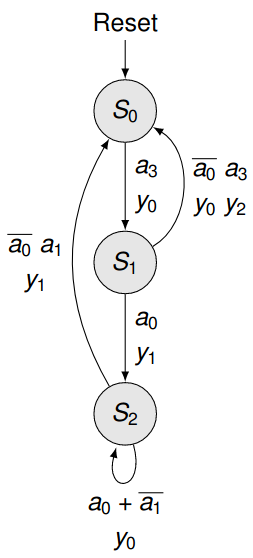
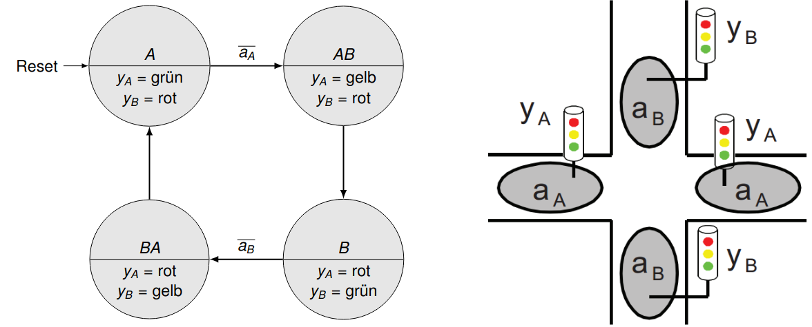
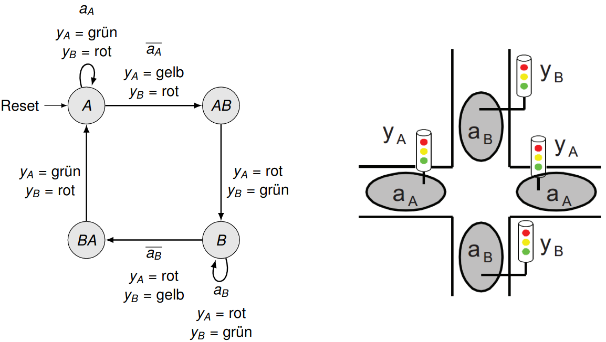
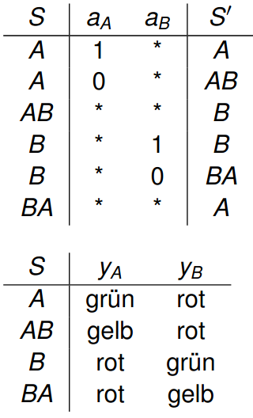
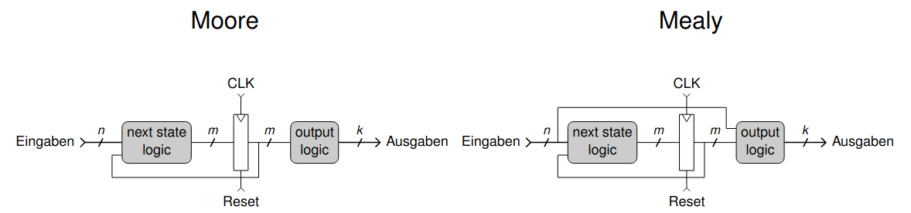
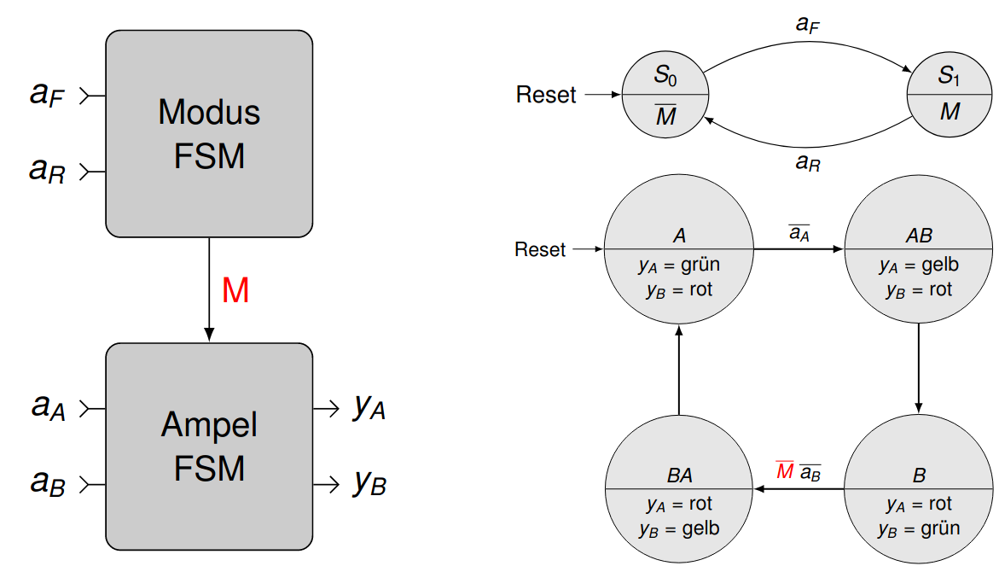

# Vorlesung am 15.12.2021
## Endliche Zustandsautomaten
$\implies$ Finite State Machines

Synchrone sequentielle Schaltungen mit  
- $n$ Eingabebits  
- $k$ Ausgabebits  
- *ein* interner Zustand  
- Takt und Reset

In jedem Takt:  
- Reset aktiv: Startzustand  
- Ansonsten: Zustand und Ausgaben aus Zustand + Eingaben berechnen

## Darstellung

- States als Knoten
- Transitions als Kanten
- Eine Kante ohne Startpunkt als Reset

### Moore-FSM

### Mealy-FSM

### Darstellung als Tabelle

## FSM als Schaltung
- Zustandsregister speichert Zustand $S$, übernimmt nächsten Zustand $S'$ bei
  steigender Taktflanke
- Zustand durch kombinatorische Logik realisiert

Zustandskodierung: Weist jedem Zustand Wert aus $m$ Bits zu
(Bitbreite frei wählbar da intern)

### Mealy vs Moore
- Moore kleiner bei statischen Ausgaben
- Mealy kleiner wenn Ausgaben Aktionen auslösen; reagiert schneller
- Fallabhängig

## Zerlegen von FSM (Dekomposition)
- Aufteilung komplexer FSM in einfache, kommunizierende FSM
- Beispiel: Ampel mit Modus "Ampel B bleibt permanent grün" mit 2 neuen
  Eingängen:
