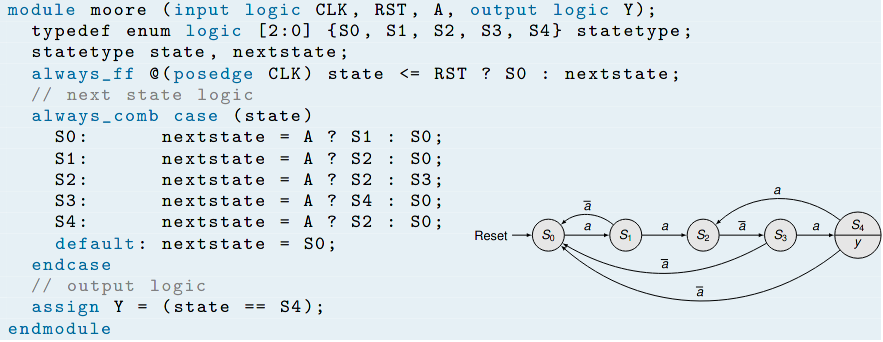

# Vorlesung am 19.01.2022
## FSM in Verilog
- Logikvektor oder `enum` für Zustände
- Zurücksetzbare Flip-Flops als Zustandsspeicher
- kombinatorische next-state Logik durch case in `always_comb` Block
- kombinatorische Ausgabe-Logik durch nebenläufige Zuweisungen

## Simulation und Synthese
- Alles in Verilog simulierbar

Nicht synthetisierbar:
- Signalinitialisierung bei der Deklaration
- initial Blöcke
- explizite Verzögerungen (per #)
- die meisten Funktionen wie $display, $time, $clog2 (ceiling of log2)
- real Signale

## Sequenzielle Grundelemente
- Zähler: +1 bei steigender Taktflanke
- Shiftregister (FIFO)
- RAM ("Speicherfeld"): Address mit Breite n, Wertbitbreite m, "n x m" 
