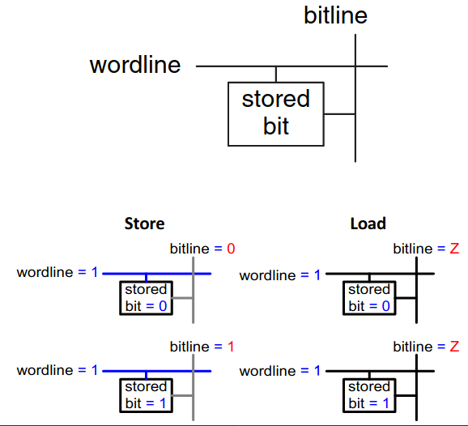
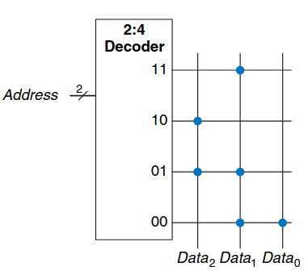

# Vorlesung am 26.01.2022
## Speicherzellen


### RAM
- Dynamic and static (DRAM/SRAM)
  - Dynamic verwendet Kondensator, muss wegen Ladeverlust regelmäßig und nach
    Lesen wieder geschrieben werden
  - Static Inverter mit Rückkopplung, dadurch stabil
- Flüchtig, schnell
- Historisch Direktzugriffsspeicher, da jedes Datenwort gleich schnell
  erreichbar ist (anders als zB Tape)

### ROM
- Flash
- Nicht flüchtig
- Schnelles Lesen, schreiben langsam oder unmöglich
- zB Kameras, USB-Sticks, SDs, SSDs, ...
- Historisch Festwertspeicher, da bei Herstellung gebrannt

Punktnotation:



Lesen durch Transistor im Cell: Zeiht auf 0 wenn vorhanden, ansonsten 1

Schreiben von Flash durch floating gate, durch hohe Spannung ent/geladen

ROM als Logik: "Lookup-Tabelle"

### Verilog
```verilog
// 2** N - word x M - bit RAM
module ram #(parameter N=6, M=32)
            (input logic clk,
            input logic we, // write enable
            input logic [N-1:0] adr,
            input logic [M-1:0] din,
            output logic [M-1:0] dout);
    
    logic [M-1:0] mem [2**N-1:0];

    // write
    always_ff @ (posedge clk)
        if (we)
            mem [adr] <= din;
    // read
    assign dout = mem [adr];
endmodule

// 4 - word x 3 - bit ROM
module rom(input logic [1:0] adr,
           output logic [2:0] dout);
    always_comb
        case (adr)
            2'b11: dout = 3'b010;
            2'b10: dout = 3'b100;
            2'b01: dout = 3'b110;
            2'b00: dout = 3'b011;
        endcase
endmodule
```

## Programmierbares Logikfeld
- Kombinatorische Logik via DNF-Form, Zweistufige Logik
- Günstiger: EEPROM: Nur Ausgabe programmierbar,
  Programmable Array Logic / PAL: Nur Eingabe programmierbar

### Performanz gegen Flexibilität
- ASICS: Für eine in Silikon realisierte Anwendung optimiert, nicht anpassbar
- Software-CPU: Führt generische Anweisungen aus, anpassbar
- Field Programmable Gate Array / FPGA vereint

### FPGAs
- Bitweise Konfigurationsspeicher statt Instruktionsspeicher
- Realisiert mit Speicher-Technologien: SRAM oder Flash

### FPGA-Komponenten
- Programmierbare Schalter: Wenn Input C 1, dann Output Y = Input A,
  ansonsten Y = Z
- Switch Matrix: Vierecksgatter aus programmierbaren Schaltern
  (jede 'Kreuzung' beliebig konfigurierbar)
- P.B. Lookup Tables (LUT)
- P.B. Logikzelle: Kombinatorische Logik oder Speicher, LUT und Schalter
- P.B. Ein-/Ausgänge: I/O Blocks (IOB): Mit physikalischem Pin verbunden

Funktionsblöcke (FB) mit verschiedenen Features:
- SRAM-Speicher
- DSP, Multiplizierer, MAC
- Taktmodifikation (Phase-Locked Loop, PLL)
- Kommunikationstreiber, USART, USB, Ethernet
- kleine Prozessoren

### FPGA-Hersteller
- Xilinx:P Zynx, Virtex, Kintex
- Intel: Cyclone, Aria, Stratix
- Microsemi: IGLOO, SmartFusion, PolarFire
- Lattice: iCE, Mach
