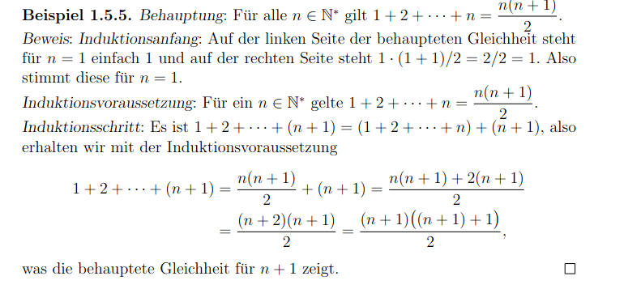

# 1.5 - Beweisprinzipien
Beweis von $A \implies B$: man nimmt $A$ an und leitet daraus $B$ ab

## Direkter Beweis
"Sei $A$ erfüllt. Dann gilt [...], also gilt auch $B$."

### Satz 1
$n, m$ gerade $\implies n \cdot m$ gerade  
Beweis: $n = 2k$ und $m = 2l$ $\space \space l, k \in \mathbb{Z}$   
dann $n \cdot m = 2k2l \rightarrow 2(2kl)$, also $n \cdot m$ gerade

### Satz 2
$n, m$ ungerade $\implies n \cdot m$ ungerade  
Beweis:
$(2k + 1) \cdot (2l + 1) = 2 \cdot 2 \cdot kl + 2k + 2l + 1 = 2(2kl + k + l) + 1$  
(Ungerade aufgrund "$+1$")

## Beweis durch Kontraposition
"Es gelte $\lnot B$. Dann gilt [...], also ist $A$ falsch."  
$\rightarrow$ Durch $\lnot A \implies \lnot B$ wird auch $A \implies B$ wahr.

### Satz 3
$n^2$ gerade $\implies n$ gerade (aus Satz 2)

### Satz 4
$n^2$ ungerade $\implies n$ ungerade (aus Satz 1)

## Beweis durch Widerspruch
"Es gelte $A$. Angenommen $B$ wäre falsch. Dann gilt [...] und es ergäbe einen
Widerspruch; es gilt $B$."

### Satz 5
$\sqrt 2$ irrational  
Annahme $\sqrt 2 = \frac n m$ mit $n, m$ teilerfremd  
Es gilt: $2 = {\sqrt 2}^2 = n^2/m^2$  
d.h $n^2 = 2m^2$   
$\rightarrow$ n gerade  
$\rightarrow$ $n = 2k; k \in \mathbb{Z}$  
$m^2 = 2k^2$  
$\rightarrow$ Widerspruch: $n, m$ beide gerade und teilerfremd

### Satz 6
Es gibt irrationale Zahlen $a, b (>0)$ mit $b^a$ rational.  
1. Fall: $\sqrt{2}^{\sqrt{2}}$ rational: $a := \sqrt 2, b := \sqrt 2$
2. Fall: $\sqrt{2}^{\sqrt{2}}$ irrational:
   $b := \sqrt{2}^{\sqrt 2}$, $a := \sqrt 2$  
   $b^a = \sqrt 2^{(\sqrt 2 \cdot \sqrt 2)} = 2$

## Prinzip der vollständigen Induktion
Beweisen, dass alle $n \in \mathbb{N}$ Eigenschaft besitzen, indem bewiesen
wird, dass wenn $A(n)$, auch $A(n+1)$ gilt.  

$A(0) \implies \forall n \in \mathbb{N}: A(n) \implies A(n+1) \implies \forall n \in \mathbb{N}: A(n)$

Idee:
$A(0) \implies A(1) \implies A(2) \implies ... \implies A(n - 1) \implies A(n)$

### Beispiel

