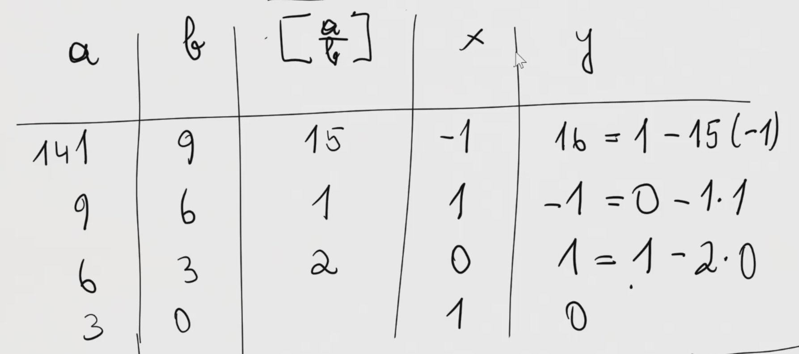

# 2.1 - Modulare Arithmetik
## Inhalt der 2 allgemein
- Strukturen: Gruppen, Ringe, Körper
- Homomorphismen, Produkte, Unterstrukturen, Quotienten
- Anwendung: RSA-Algorithmus

## Teiler, Primzahlen, Restklassenarithmetik
Restklassenarithmetik: $\mathbb{Z}_n$ ("Z modulo n")

Definition: $a, b \in \mathbb{Z}, p \in \mathbb{N}$  
a) $p \mid a$ (p teilt a) wenn $\exists m \in \mathbb{Z} : a = m \cdot p$  
b) $PZ(p)$ (p ist Primzahl) wenn
   $p > 1 \land \forall n \in \mathbb{N}: n \mid p \implies (n = p \lor n = 1)$  
c) $ggT(a,b) = \max \{ n \in \mathbb{N} : n \mid a \land n \mid b \}$

### Satz  
Sei $a, b \in \mathbb{Z}$ mit $b > 0$  
Dann existiert eindeutig bestimme $q \in \mathbb{Z}$ und
$r \in \{ 0, 1, .., b - 1 \}$ mit $a = q \cdot b + r$.

$\lfloor \frac a b \rfloor$ für $q$ und $a \mod b$ für $r$

**Beweis**:  
$M = \{ s \in \mathbb{N} : s \cdot b \le a \} (\le a)$  
$q := \max(M), r := a - q \cdot b$  
Damit in jedem Fall $a = q \cdot b + r$, da $q$ die größte Zahl, bei der noch
$q \cdot b \le a$ gilt.

Zum Nachweis von $r$ lässt sich aus
$q \cdot b \le a$; $r = a - q \cdot b \ge 0$ herleiten.   
Wird $r \ge b$ angenommen, gilt: $(q + 1) \cdot b = qb + b \le qb + r = a$  
Damit entsteht ein Widerspruch ($q + 1 \in M$) und somit gilt $r < b$.

Eindeutigkeit zeigen:  
Sei $q_1,q_2 \in \mathbb{Z}$ und $r_1,r_2 \in \{0,1,..,b-1\}$ mit
$a = q_1 \cdot b + r_1 = q_2 \cdot b + r_2$  
Dann gilt: $(q_1 - q_2) \cdot b = r_2 - r_1$  
Damit teilt $b$ $r_2 - r_1$, jedoch kann in diesem Zahlenbereich nur 0 durch
$b$ geteilt werden; es folgt $r_1 = r_2$ aus $r_2 - r_1 = 0$.  
Damit $q_1 \cdot b = q_2 \cdot b$ und da $b \not= 0$, $q_1 = q_2$.

**Definition**: Für Satz oben: Division ganzer Zahlen $a$ und $b$,
$q$ Quotient, $r$ Rest.  
$q = \lfloor \frac a b \rfloor$ und $r = a \mod b$. 

### Satz
Für $a, b \in \mathbb{Z}$ gilt  
a) $(a + b) \mod n = ((a \mod n) + (b \mod n)) \mod n$  
b) $(a \cdot b) \mod n = ((a \mod n) \cdot (b \mod n)) \mod n$  
c) $a^b \mod n = (a \mod n)^b \mod n$  (für $b \ge 0$)

**Beweis** a):  
$k = \lfloor a / n \rfloor, l = \lfloor b / n \rfloor$  
$a + b = k \cdot n + a \mod n + l \cdot n + b \mod n$  
$(k + l) n + a \mod n + b \mod n$ ($n \mid (k + l) n$)  
also: $(a + b) \mod n = ((a \mod n) + (b \mod n)) \mod n$

**Beweis** b): TODO!!  

### Beispiel
$3^{444} + 4^{333} \mod 5 = 9^{222} + 4^{333} \mod 5$  
$= ((9^{222} \mod 5) + (4^{333} \mod 5)) \mod 5$  
$= (-1 \mod 5)^{222} + ((-1) \mod 5)^{433} \mod 5$  
$= 1 + (-1) \mod 5 = 0 \cdot \mod 5$  

## Euklidischer Algorithmus
Zum berechnen des größten gemeinsamen Teilers von 2 Zahlen  
Seien $a, b \in \mathbb{N}*$ mit $a \ge b$, dann

a) $ggT(a, b) = ggT(b, a \mod b)$  
b) $b \mid a \implies ggT(a, b) = b$

### Beweis
a) $n \mid a \land n \mid b \iff n \mid b \land n \mid (a \mod b)$  
$\implies:$ wenn $a = kn, b = ln$, dann $a \mod b = a - q \cdot b$  
$= (k - ql)n$, also $n \mid (a \mod b)$  
$q = \lfloor \frac a b \rfloor = kn - qln$  
$\Longleftarrow:$ wenn $b = kn$ und $a \mod b = l \cdot n = r$  
dann $a = qb + r = qkn + l \cdot n = (qk + l) \cdot n$  
also $n \mid a$

### Beispiel
$128 \mod 36 = 20$, da $3 \cdot 36 = 108$  
$= 36 \mod 20 = 20 \mod 16 = 16 \mod 4 = 0 \mod 4$  
$\implies ggT(128, 36) = 4$

### Definition
$eukl(a, b) =$ if $b = 0$ then $a$ else $eukl(b, a \mod b)$  
$\implies$ liefert $ggT(a, b)$, wenn $a \ge b$

$d = ggT(b, a \mod b) = x \cdot b + y \cdot (a \mod b)$  
$\implies$ terminiert, da bei rekursivem Aufruf Argumente kleiner werden.

## Erweiterter Euklid. Alg
$f(a, b) =$ if $b = 0$ then $a(a,1,0)$  
else $let(d,x,y) = f(b, a \mod b)$ in
$(d,y,x - \lfloor \frac a b \rfloor \cdot y)$

$a \ge b \implies d = ggT(a, b) = x \cdot a + y \cdot b$  
wobei $(d,x,y) = f(a,b)$

### Beispiel

$f(a, n) = (1, x, y) \implies 1 = xa + y \cdot n$, d.h. $ax = 1 \mod n$

### Satz
$ggT(a, n) = 1 \implies (n \mid ab \implies n \mid b)$

## Kleiner Satz von Fermat
Für alle Primzahlen $p$ und alle $a \in \mathbb{N}$ gilt $a^p ≡ a (\mod p)$
