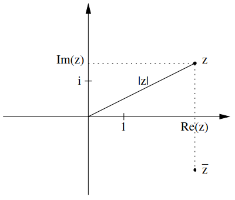

# 2.5 - Komplexe Zahlen
Körper $\mathbb{C}$ der Komplexen Zahlen

**Idee**: $z = x + iy$ mit $i^2 = -1$

\begin{align}
z &= x + iy \\
w &= u + iv \\
\\
z + w &= (x + u) + i(y + v) \\ 
z \cdot w &= xu + i^2yu + ixv + iuy = xu - yu + i (xv + uy) \\
\end{align}

## Definition
$\mathbb{C}$ als $\mathbb{R} \times \mathbb{R}$

\begin{align}
(x,y) \oplus (u,v) &= (x + u, y + v) \\
(x,y) \odot (u,v) &= (xu - yv, xv + yu) \\
((x,y) &\approx x + iy)
\end{align}

Körperaxiome lassen sich nachrechnen und sind korrekt; Beweis im Skript auf
Seite 41

$(\mathbb{R},\oplus,\odot)$ ist Körper der Komplexen Zahlen und wird üblich mit
$\mathbb{C}$ bezeichnet.

$\iota: \mathbb{R} \to \mathbb{C}: x \mapsto (x, 0) = x + i \cdot 0 = x$

$i = (0, 1)$  
$i^2 = (0 \cdot 0 - 1 \cdot 1, 0 \cdot 1 + 1 \cdot 0) = (-1, 0) = -\iota(1)$

## Konjugation
$z = x + iy$  
$\overline z = \overline{x + iy} = x - iy$  
$z \overline z = x^2 + y^2$  
$\overline{\overline z} = z$

$z^{-1} = (\frac{x}{x^2 + y^2}, \frac{-y}{x^2 + y^2})$  
$zz^{-1} = (1, 0) = \iota(1)$  

Konjugation des Produkts 2 komplexer Zahlen gleich des Produkts der Konjugation
2 komplexer Zahlen.

## Definition, fortgesetzt
$\iota[\mathbb{R}] = \{ z \in \mathbb{C} | z = \overline z \}$

$Re(z) = x$; Realteil von $z$  
$Im(z) = y$; Imaginärteil von $z$  
Ist $y = 0$ ist $z$ *reell*, ist $x = 0$ ist $z$ *rein imaginär*.

*Beachten*: Imaginärteil einer komplexen Zahl immer reell  
($Im(3 + 2i) = 2 \not= 2i$)

## Gauß'sche Zahlenebene
  
Komplexe Zahlen aus $\mathbb{R}^2$, daher durch Zahlenebene gut veranschaulicht

## Länge
$|z| = \sqrt{z \overline z} = \sqrt{x^2 + y^2}$

$Re(z) = \frac{z + \overline z}{z}$  
$Im(z) = \frac{z - \overline z}{2i}$

$\frac 1 i = -i$

## Satz
a) $|z| = |\overline z|$  
b) $z \cdot \overline z = |z|^2$  
c) $z^{-1} = \frac{\overline z}{|z|^2}$  
d) $|Re(z)| \le |z| \ge |Im(z)|$  
e) $|z| \in \mathbb{R}, |z| \ge 0$ und $z = 0 \iff |z| = 0$  
f) $|z_1 \cdot z_2| = |z_1| \cdot |z_2|$  
g) $|z_1 + z_2| \le |z_1| + |z_2|$

## Ordnung
Es gibt keine Ordnung $\le$ auf $\mathbb{C}$, die $\mathbb{C}$ zu einem
angeordneten Körper macht.

$z^2 \ge 0$, also $-1 > 0$, also $0 > 1$, im Widerspruch zu $1 > 0$

## Fundamentalsatz der Algebra
Es sei $n ∈ N∗$ und $p(z) = a_nz^n + a_{n−1}z^{n−1} + ··· + a_1z + a_0$ ein
Polynom mit $a_j \in \mathbb{C}$ für $j = 0,1,...,n$ und $a_n \not= 0$.
Dann hat $p$ eine Nullstelle in $\mathbb{C}$.
Jedes komplexe Polynom zerfällt über $\mathbb{C}$ in Linearfaktoren.

**Bemerkung**: Der Fundamentalsatz der Algebra bedeutet, dass jede polynomiale
Gleichung über $\mathbb{C}$ lösbar ist.  
Somit ist anders als bei $\mathbb{R}$ $x^2 + 1 = 0$ lösbar
