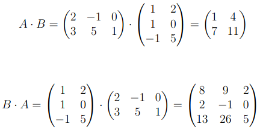
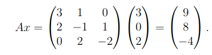
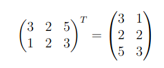
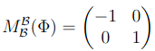
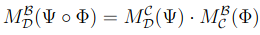

# 3.7 - Matrizen und lineare Abbildungen
## Matrizenrechnung
### Multiplikation

- Skalarprodukt von Zeile $A$ mit Spalte $B$

Es gilt:  
$A(x + y) = Ax + Ay$  
$(A + B)x = Ax + Bx$

### Quadratische Matrix
Matrix quadratisch, wenn $p = n$  
Es gilt: $(K^{n×n}, +, \cdot)$ ist ein Ring mit Eins, der für $n \ge 2$ nicht
kommutativ ist.

### Transponieren

- $(A + B)^T = A^T + B^T$
- $(A^T)^T = A$
- $(\lambda A)^T = \lambda A^T$

## Lineare Abbildung
Bei $\Phi: V \to W$, $\mathcal{B}$ von $V$ und $\mathcal{C}$ von $W$  
Darstellungsmatrix / Abbildungsmatrix: $M^\mathcal{B}_\mathcal{C}(\Phi)$

**Merkregel**: In den Spalten der Abbildungsmatrix stehen die Koordinaten
der Bilder der Basisvektoren.

### Beispiel
Spiegelung an der $x$-Achse in $\mathbb{R}^2$:

### Definition
Bei $\Phi: V \to W$, $\mathcal{B}$ von $V$ und $\mathcal{C}$ von $W$  
$A \in K^{p \times n}$, $a_1,...,a_n$ Spalten von $A$

- $Rang(A) := dim(\langle a_1,...,a_n \rangle)$: (Spalten)-rang von $A$
- $ker(A) := \{ x \in K^n: Ax = 0 \}$: Kern von $A$

- $Rang(\Phi) = Rang(A)$
- $Rang(A)$ ist Maximalanzahl linear unabhängiger Spalten in $A$
- $dim(ker(\Phi)) = dim(ker(A))$
- $dim(V) = Rang(A) + dim(ker(A))$

Verkettung:

$A \in K^{n \times n}$ invertierbar oder regulär, wenn $A−1 \in K^{n \times n}$
existiert mit $A \cdot A−1 = I$ und $A−1 \cdot A = I$. $A−1$ heißt dann Inverse
von $A$. Ist $A$ nicht regulär, ist es singulär.

Folgende Aussagen sind äquivalent:

- $A$ ist invertierbar.
- $Rang(A) = n$
- $ker(A) = \{0\}$

