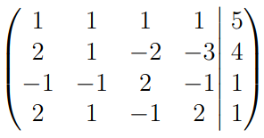
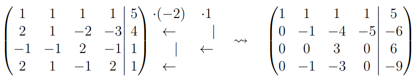
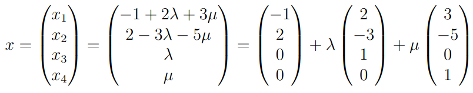

# 3.8 - Lineare Gleichungssysteme

Ein LGS ist die Gleichung $Ax = b$; Matrix $A$ und Vektor $b$ ist gegeben; Vektor $x$ gesucht.

Ein LGS ist homogen, wenn $b = 0$. Ansonsten inhomogen.

Ein LGS ist lösbar, wenn ein $x$ existiert, unlösbar wenn nicht. Es ist eindeutig lösbar,
wenn nur genau ein $x$ existiert.

## Lösungstheorie
### Quadratische Matrizen
Bei $A$ mit $p = n$ ist ein LGS eindeutig lösbar, wenn $A$ invertierbar ist:  
$x = A^{-1}b$

### Nullmatrix
Ist $A$ Nullmatrix, so ist nur bei $b = 0$ lösbar; jedes $x$ ist dann eine Lösung

### b = 0
Ist $Ax = 0$, ist das LGS immer mit dem Nullvektor lösbar.  
Ebenfalls bilden alle Lösungen $ker(A)$.

## Lösen von LGS
Besteht eine Lösung $x$ für $Ax = b$, so sind alle Lösungen gegeben durch  
$\{x \in K^n: Ax = b \} = \{ x_s + y: y \in ker(A) \}$

Alle Lösungen befinden sich in der gleichen Äquivalenzklasse in $V \setminus ker(A)$.

### Lösbarkeit
$A|b$ sei die Matrix, die $b$ als zusätzliche Spalte an $A$ enthält. Dann gilt:

- $Ax = b$ ist genau dann lösbar, wenn $Rang(A) = Rang(A|b)$ gilt
- Folgende Aussagen sind äquivalent:
  - $Ax = b$ ist eindeutig lösbar
  - $Ax = b$ ist lösbar und $ker(A) = \{0\}$
  - $Rang(A) = Rang(A|b) = n$

## Gauß-Algorithmus
LGS gekürzt dargestellt:

Nun Elementarumformungen anwenden:

- Vertauschen von 2 Zeilen
- Multiplizieren einer Zeile mit einem Element von $K$
- Addition eines Vielfachen einer Zeile mit einer anderen Zeile

Notation:

Hier wurde das $-2$-fache von I zu II und IV addiert, und I zu III.  
(Wird eine Zeile mit einem Element von K multipliziert, werden die Pfeile weggelassen.)

### Lösen mit Variablen
Sollte es keine eindeutige Lösung geben, müssen Variablen beibehalten werden, um auf
die Lösungsmenge zu kommen.

