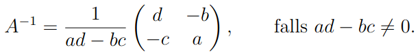
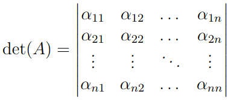
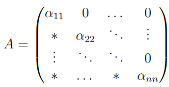

# 3.10 - Determinanten
Bei Matrix $A \in K^{2 \times 2}$ lässt sich $A^{-1}$ wie folgt berechnen: 

$ad - bc$ ist die *Determinante*.

## Definition
- $A \in K^{n \times n}$ und $j, k \in \{1, 2, ... , n\}$.
  $A_{jk} \in K^{(n−1) \times (n−1)}$ bezeichnet die Matrix, durch Streichen
  der $j$-ten Zeile und der $k$-ten Spalte entsteht.
- Bei $A = (\alpha)$ ist $det(A) := \alpha$.
- Bei $n > 1$ gilt  
  $det(A) = \sum_{k=1}^n (-1)^{1+k}\alpha_{1k}det(A_{1k})$

Schreibweise:

### Untere Dreiecksmatrix
Ist $A$ eine "untere Dreiecksmatrix", d.h. wie folgend:

dann gilt immer $det(A) = 1$.

## Satz
- Wenn 2 beliebige Zeilen vertauscht werden, ändert sich bloß Vorzeichen der
  Determinante
- $det(A)$ ist linear in jeder Zeile
- Wird zu einer Zeile das $\lambda \in K$-fache einer anderen addiert, bleibt
  die Determinante gleich.
- Statt nach der ersten Zeile zu entwickeln, vgl. die Definition
  der Determinante, kann auch nach der $j$-ten Zeile für jedes $j$ entwickelt
  werden. 
  Genauer gesagt gilt für jedes solche $j$:
  $det(A) = \sum_{k=1}^n (-1)^{1+k}\alpha_{jk}det(A_{jk})$
- $det(A) = det(A^T)$
- $det(AB) = det(A)det(B)$
- $det(\lambda A) = \lambda^n det(A)$
- Ist $Rang(A) < n$, ist $det(A) = 0$
- Matrizen sind genau dann invertierbar, wenn $det(A) \not= 0$.
  Es gilt: $det(A^{-1}) = det(A)^{-1}$
- Sind Matrizen ähnlich, so gilt $det(A) = det(B)$
