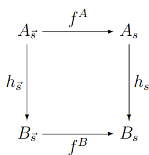

# 4.2 - Signaturen, Algebren und Homomorphismen
## Signaturen
Signaturen sind Tripel $\Sigma = (S, F, ar)$

- $S$: Menge der Sortensymbole
- $F$: Menge der Funktionssymbole
- $ar$: Stelligkeitsfunktion ("arity function"), $ar: F \to S^* \times S$

Alternative Schreibweisen: $\Sigma_{sort}$, $\Sigma_{func}$, $\Sigma_{ar}$  
und $ar(f) = (s_1...s_n, s)$ als $f: s_1 \times ... \times s_n \to s$

### Algebren
Eine $\Sigma$-Algebra $A$ besteht aus:

- "Trägermenge der Sorte $s in $A$: Menge $A_s$ mit $\forall s \in A_s: s \in S$
- "Interpretation von $f$ in $A$: Funktion
  $f^A: A_{s1} \times ... \times A_{sn} \to A_s$ für jedes $f \in F$,
  wobei $ar(f) = (s_1...s_n,s)$

Abkürzung: $\vec s = s_1...s_n \in S^*$  
$A_{\vec s} = A_{s1} \times ... \times A_{sn}$

### Homomorphismen
Ein $\Sigma$-Homomorphismus von Algebren $A$ nach $B$ ist eine Familie von
Funktionen $(h_s: A_s \to B_s)$, so dass gilt:  
$h_s(f^A(x_1,...,x_n)) = f^B(h_{s1}(x_1),...,h_{sn}(x_n))$

Dies bedeutet, dass Algebraoperationnen und Homomorphismus vertauschbar sind:

Ein Homomorphismus ist ein Isomorphismus, wenn alle $h_s$ Bijektionen sind.  
Dies lässt sich durch einen eindeutig bestimmten HM $h^{-1}: B \to A$ mit
$h^{-1} \odot h = id_A$ und Gegenteil für $B$ zeigen.

