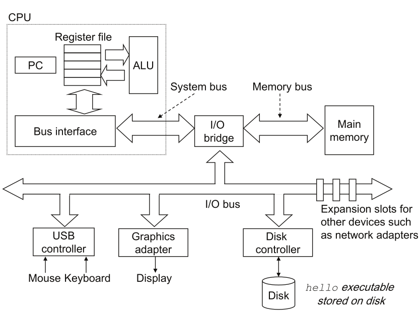

# Vorlesung am 25.04.2022
*Notiz: ISA steht für "Instruction Set Architecture".*

## Speicherhierarchie
Explizite und transparente (dem Nutzer unsichtbare) Nutzung von Speicher

Hierarchie, von klein, teuer und schnell zu groß, günstig und langsam:

- L0: CPU-Register
- L1 cache (SRAM)
- L2 cache (SRAM)
- L3 cache (SRAM)
- L4: Main memory (DRAM)
- L5: Local secondary storage (Disks)
- L6: Remote secondary storage (Distributed storage, Network)

###
- Register enthalten Wörter aus L1
- Caches enthalten Lines aus vorherigem (aus L4 RAM bei L3)
- L4 enthält Blocks von L5
- L5 enthält Dateien von L6

### Expliziter Speicher
- Prozessorspeicher (Register/L0)
    - Schnell, für temporären Speicher
    - Direkter Zugriff mit ISA
    - Mit Halbleiter ICs realisiert
- Hauptspeicher (DRAM/L4)
    - Relativ groß und schnell für Programme und Daten
    - Direkter Zugriff mit ISA
    - Mit Halbleiter ICs realisiert
- Sekundärspeicher (Disks/L5)
    - Sehr groß aber langsam; für permanenten Speicher
    - Indirekter Zugriff über IO-Programme
    - Mit H-ICs, Magnetplatten, Optischen Medien, Tape, etc. realisiert

## Maschinennahe Programmierung
- Programmiermodell: Sicht des Programmierers auf Computer, definiert durch ISA
    - Bei höheren Programmiersprachen: Eigenschaften der Sprache
- Mikroarchitektur: Hardware-Implementierung des ISA
- Programmierparadigma ("Denkmuster"): Übergeordnetes Prinzip; ASM ein primitives Paradigma

### ASM
"Assembly", Befehlssatz der Architektur. Darstellbar als Assemblersprache (Menschen-lesbar/schreibbar), 
und als Maschinensprache (binäres Format, das ausführbar ist)

### ARM ISA
- 1983 von Acorn entwickelt (Acorn/Advanced RISC Machines)
- Beliebt in vielen Bereichen: Embedded, Mobile Geräte, Supercomputer
- zB.: Apple M1, Raspberry Pi / SBCs, Smartphones, etc.
- 13 Generelle Register (R0-12), SP (R13), LR (R14), PC (R15)

### Komponenten eines modernen Rechnersystems

- CPU führt Befehle im Hauptspeicher aus
- ALU führt mathematische Befehle aus ("Arithmetic Logic Unit")
- PC zeigt auf nächsten Befehl ("Program Counter")
- Register sind schnell; speichern Operanden
- Hauptspeicher speichert Befehle und Daten
- Bus verbindet Komponenten

### Übersetzung eines Programms
Beispiel an einem "Hello World" C-Programm:

- C-Preprocessor verarbeitet Source (Directives wie `#include`)
- Compiler produziert Menschen-lesbares Assembly
- Assembler produziert binäres ASM (Object file)
- Linker fügt Object files zusammen (löst Referenzen auf) und produziert eine ausführbare Object file

### Ausführung eines Programms
- Wenn Ausführung durch Shell: Shell verarbeitet Command
- Auszuführende Object file wird in RAM geladen;
  oft ohne CPU direkt von Sekundärspeicher (DMA, "Direct Memory Access")
- CPU führt Befehle des Programms aus

### Implementation von ISAs
- Welche Befehle soll eine CPU haben?
- Kann minimal sein: Einfachere CPU, jedoch mehr Befehle für Aufgaben benötigt: RISC
    - Beispiel: ARM, RISC-V, PowerPC
    - Befehle oft identische Ausführungszeit; Pipelining einfacher
    - Oft Load/Store-ISAs genannt, da Operationen nur auf Register
- Kann viele Befehle haben: Komplexere CPU, weniger Befehle benötigt: CISC
    - Beispiel: x86(-64), IBM z/Architecture
    - Operationen auf Register und RAM

###
- Interner Aufbau hat viele Freiheitsgrade
- Struktur der CPU für Performance und Kosten wichtig
- Einteilung nach Anzahl der Operanden eines Befehls; "n-Adressmachinen"
    - x86 2-Adressmaschine; teils 3
    - ARM 3-Adressmaschine

### Speicherorganisation
Big/Little Endian: Schemata für Byte-Nummerierung in einem Wort  
Big Endian: Höchstwertiges Byte an kleinster Speicheradresse ("Motorola-Format")  
Little Endian: Kleinstwertiges Byte an kleinster Speicheradresse ("Intel-Format")
