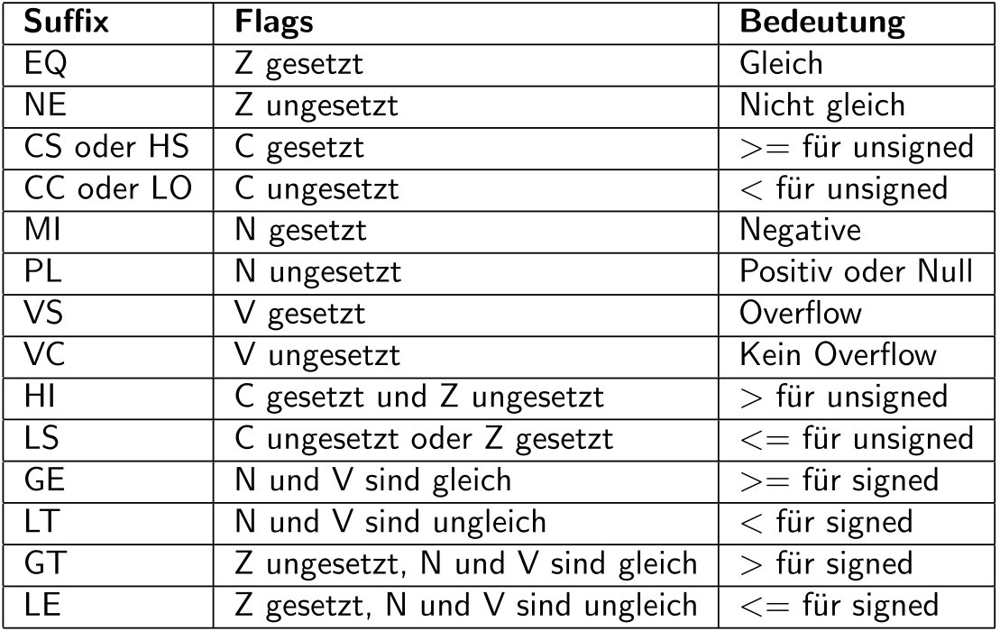

# Vorlesung am 02.05.2022
## ARM-ISA
### Register
- R0-R12: General-purpose-Register
- R13: SP (Stack pointer)
- R14: LR: Link register
- R15: PC: Program counter
- CPSR: Current Program Status Register (enthält u.a Statusflags)

### Adressierung
- ARM byte-adressiert; jedes Byte eindeutige Adresse
- Wortgröße ist 32bit, Wort-Adressen also vielfaches von 4


## Instructions
### Load/Store
Adressen immer mit Offset einer Adresse in einem Register angegeben

```nasm
mov r5, #0          ; Load immediate value '0' into r5
ldr r7, [r5,#8]     ; Load word at address (r5 + 8 = 8) into r7
ldr r8, [r5,#0xC]   ; Load word at address (r5 + 12 = 12) into r8

mov r6, #42
str r6, [r5,#0x14]  ; Store word in r6 (42) at address (r5 + 20 = 20)

; There are also ldrb/strb which act on bytes instead:
ldrb r1, [r5, #3]   ; Load byte at address (r5 + 3 = 3) into r1
strb r1, [r5, #3]   ; Store byte in r5 at address (r5 + 3 = 3)
```

### Arithmetic
Letzter Parameter kann Register oder Immediate sein; Immediate max. 12 Bytes.

```nasm
add r0, r0, #4      ; r0 = r0 + 4
add r1, r0, #-12    ; r1 = r0 - 12

; Also available: sub, mul, orr, and
```


## Control Flow
### Flags
- Control Flow durch Statusflags gesteuert, die Eigenschaften des Ergebnisses
  der letzten Arithmetikoperation abgeben; wichtigsten auf ARM:
    - C: Carry (Ergebnis passt nicht; Carry bleibt über)
    - Z: Zero (Ergebnis ist 0)
    - N: Negative (Ergebnis ist negativ; MSB = 1)
    - V: Overflow (Ergebnis hat als signed Overflow verursacht)

### Unconditional Jump
```nasm
add r1, r2, #17
b target            ; Unconditionally jump
mov r1, #0          ; Not executed

target:             ; Label that is jumped to
sub r1, r1, #2      ; Execution continues here
```

### Conditional Jump
```nasm
mov r0, #4
add r1, r0, r0

; Calculate r0 - r1 and set status flags, but discard the result
cmp r0, r1          ; "Compare"; Here: N=1, other flags 0
beq after           ; "Branch if equal"; jump if Z=1 (here: no jump)
orr r1, r1, #1      ; This is executed, since jump condition not met.

after:
add r1, r1, #54

; Also available next to cmp: tst
; Bitwise AND r0 and r1 and set status flags, but discard the result
tst r0, r1          ; "Test"
```

Suffixes für Branch-Instructions ("Condition Codes"):




## Abbildung von Hochsprachen zu ASM
### If
```nasm
; High-level:
if (r0 == r1) r2 = r3 + 1
r2 = r2 - r3

; ASM:
cmp r0, r1
bne L1
add r2, r3, #1
L1:
sub r2, r2, r3
```

### If-Else
```nasm
; High-level:
if (r0 == r1) r2 = r3 + 1
else r2 = r2 - r3

; ASM:
cmp r0, r1
bne L1
add r2, r3, #1
b L2
L1:
sub r2, r2, r3
L2:
```

### While
```nasm
; High-level:
r0 = 1, r1 = 0
while (r0 != 128):
    r0 = r0 * 2
    r1 = r1 + 1

; ASM:
mov r0, #1
mov r1, #0
LOOP:
cmp 0, #128
beq BREAK
lsl r0, r0, #1
add r1, r1, #1
b LOOP
BREAK:
```

### C-Style For
```nasm
; High-level:
r0 = 0
for (r1 = 0; r1 < 10; r1++):
    r0 = r0 + r1

; ASM:
mov r0, #0
mov r1, #0
LOOP:
cmp r1, #10
bge BREAK
add r0, r0, r1
add r1, r1, #1
b LOOP
BREAK:
```
