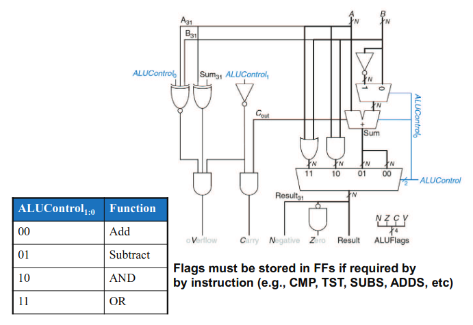
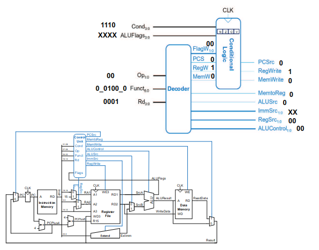

# Vorlesung am 30.05.2022
## Mikroarchitekturen
### Komponenten
- Alle Designs benötigen mindestens Prozessor, RAM, und I/O.
- Diese kommunizieren über Buses
- Zur Synchronisation ein geteiltes Takt/Clocksignal:
    - Rechteck/Square-Signal
    - Taktfrequenz durch diese Clock definiert: Schnellerer Clock -> Schnelleres Rechnen

### Ausführung eines Befehls
3 Stufen, die für jedeb Befehl wiederholt werden:

- Fetch: Befehl wird aus dem Speicher gelesen
- Decode: Befehl, der sich jetzt in einem Register befindet, wird dekodiert bzw. interpretiert
- Execute: Dekodierter Befehl wird ausgeführt

## Definitionen
- ISA: Instruction set architecture (Liste an möglichen Befehlen einer Architektur, zB ARM32)
- RISC/CISC: Reduced/Complex instruction set computer
- SIMD: Single instruction multiple data (Instruction, die mehrere Daten gleichzeitig behandelt)
- VLIW: Very long instruction word; superscalar processors
- $\mu$arch: Microarchitecture: Implementierung ISA
    - IPC: Instructions per cycle
    - ILP: Instruction level parallelism (Pipelining)
    - Branch prediction
    - Out-of-order execution (superscalar)
    - Multi-issue systems

## Einführung in die Mikroarchitektur
- Mehrere Implementationen möglich
- Unterscheidung ist Art der Ausführung
    - Eintakt-Implementierung: Jeder Befehl wird in einem Takt ausgeführt
    - Mehrtakt-Impl.: Jeder Befehl ist in Teilschritte über mehrere Takte zerlegt
    - Pipelining-Impl.: Mehrtakt; mehrere Teilschritte werden parallel ausgeführt
- Rechnersystem hat generell 2 "Pfade":
    - Datenpfad: Verbindet verschiedene Komponenten innerhalb und außerhalb der CPU
    - Kontrollpfad: Steuersignale/Steuerwerk

### Beispiel an ARM32
ASM-Mnemonic `mov r0, #1` übersetzt zu `0xE3A0 0001`; 20 Bits für Instruction und
12 Bits für den Immediate-Wert `1`.

### Architekturzustand
- Für den Programmierer sichtbare bzw. zugängliche Daten
- Bei ARM: PC, 16 Register, Speicher

- Von-Neumann-Arch.: Gemeinsamer Speicher für Code und Daten (heutzutage dominant)
- Harvard-Arch.: Code/Daten getrennt

### Datenpfad bei ARM ldr
Beispiel an `ldr r1, [r2, #5]` innerhalb eines Eintakt-Prozessors:

1. Befehl aus Speicher holen
2. Lesen der Quelloperanden vom Registerfeld
3. Erweiterung des Immediate von 12 auf 32 Bit
4. Berechnung der Speicheradresse
5. Lesen der Daten und Schreiben in das Register
6. Berechnung der Adresse des nächsten Befehls (PC-Inkrement)

### ALU
Arithmetic Logic Unit, die verschiedene Berechnungen durchführt

### Einheit ExtImm
- Immediates müssen je nach Befehl unterschiedlich erweitert werden
- Gibt zB 1 Byte Imms, 12 Bit Imms, etc.

### Kontrolleinheit
- Dekodiert Befehle und setzt entsprechend Flags
- Beispiel an Add:

