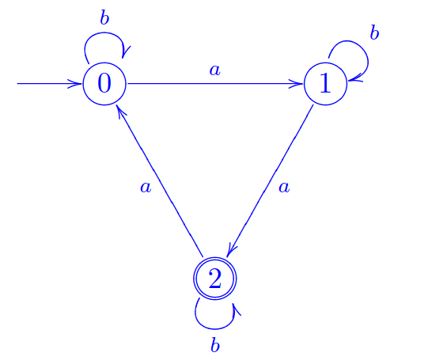

# Vorlesung am 19.11.2021
## Reguläre Ausdrücke
Menge $REG(\Sigma)$ (Reguläre Ausdrücke) über $\Sigma$ induktiv erzeugt:

- $\emptyset \in REG(\Sigma)$
- $\forall \alpha \in \Sigma: a \in REG(\Sigma)$ 
- $\forall \alpha,\beta \in REG(\Sigma): (\alpha + \beta) \in REG(\Sigma)$
- $\forall \alpha,\beta \in REG(\Sigma): (\alpha\beta) \in REG(\Sigma)$
- $\forall \alpha \in REG(\Sigma): \alpha^* \in REG(\Sigma)$ 

### Sprachen
Jedem regulären Ausdruck (Syntax) wird induktiv eine Sprache $L(\alpha) \subseteq \Sigma*$ zugeordnet (Semantik).

$L(\alpha)$ = durch $\alpha$ erzeugte Sprache  
**reguläre Sprache** $L$, wenn $\exists \alpha \in REG(\Sigma): L = L(\alpha)$

- $L(\emptyset) := \emptyset$
- $L(\alpha) := \{\alpha\}$
- $L(\alpha + \beta) := L(\alpha) \cup L(\beta)$
- $L(\alpha\beta) := L(\alpha) \cdot L(\beta)$
- $L(\alpha^*) := (L(\alpha))^*$

### Beispiele
Sei $\Sigma := \{0,1\}$, dann ist $L$ reglär:  
$L = L(0^*10^*)$  
$L$ ist eine Sprache mit beliebig vielen 0 und genau einer 1.  
($0^*$ = beliebig viele 0)  
$\overline L$ ist ebenfalls regulär, und gibt "beliebig viele 0, $|1| \not= 1$" an.

Sei $\Sigma := \{a_1,...,a_n\}$, dann sind regulär:

- $L(\emptyset^*) = \{\varepsilon\}$
- $\Sigma = L(a_1 + ... + a_n)$
- $\Sigma* = L((a_1 + ... + a_n)^*)$
- $\Sigma+ = L((a_1 + ... + a_n)(a_1 + ... + a_n)^*)$

### Zusammenfassung
Die regulären Sprachen werden ausgehend von den Sprachen $\emptyset$ und $\{a\}$ durch die Operationen Vereinigung, Konkatenation und Stern erzeugt.

## Transitionssysteme
$\mathcal{S} = (\Sigma,Q,\triangle)$

- $\Sigma$: Alphabet
- $Q$: Zustandsmenge, endlich, $\not= 0$
- $\Delta \subseteq Q \times \Sigma \times Q$: Transitionsrelation
- $(q,a,q') \in \Delta$ steht für Transition q--a-->q'

### Deterministische endliche Automaten (DFA)
Transitionssysteme zur Erkennung von Sprachen

Transitionsrelation $\Delta \subseteq Q \times \Sigma \times Q$ ist T.-Funktion  
$\delta: Q \times \Sigma \to Q$ ($(q,a) \mapsto \delta(q,a) \in Q$)

Kein Deadlock, keine Auswahl (= eindeutig bestimmter Nachfolgezustand)

### Definition DFA
$\mathcal{A} = (\Sigma, Q, q_0, \delta, A)$

- Zustandsmenge $Q$ (endlich, nicht leer)
- Anfangszustand $q_0 \in Q$ 
- Menge $A \subseteq Q$ akzeptierter Zustände
- Übergangsfunktion $\delta: Q \times \Sigma \to Q$

### Berechnung von A
Zustandsfolge $q_0, q_n$ mit $q_{i+1} = \delta(q_i,a_{i+i})$ für $0 \le i < n$

Läuft von $q_0$ zu $q_1$ zu ... zu $q_n$  
$\hat \delta(q_0,w)$ = Endzustand $q_n$ (Iteration von $\delta$, bis Ende)

$w = a_1...a_n$ mit Berechnung $q_0,...,q_n$ ist von $\mathcal{A}$ akzeptiert, wenn $q_n \in A$

Von $\mathcal{A}$ akzeptierte Sprache:  
$\{ w \in \Sigma*: \mathcal{A} \space \text{akzeptiert w} \}$  
$\{ w \in \Sigma*: \hat \delta(q_0,w) \in A \}$

### Beispiel
$\Sigma = \{a,b\}$  
DFA für $|w|_a \equiv 2 \mod 3$

$A = {2}$

### Nicht-deterministische endliche Automaten (NFA)
$\mathcal{A} = (\Sigma, Q, q_0, \Delta, A)$

- Zustandsmenge $Q$ (endlich, nicht leer)
- Anfangszustand $q_0 \in Q$ 
- Menge $A \subseteq Q$ akzeptierter Zustände
- Übergangs**relation** $\Delta \subseteq Q \times \Sigma \times Q$

**Jede** Zustandsfolge $q_0,...,q_n$ mit $(q_i,a_{i+1},q_{i+1}) \in \Delta$  
Nicht eindeutig, $q_n$ nicht notwendig existent.

### NFA-Sprachen
Sprache von NFA $\mathcal{A}$ akzeptiert, wenn:  
$L(\mathcal{A}) := \{ w \in \Sigma*: \mathcal{A} \space \text{hat akzeptierende Berechnung auf} \space w \}$

Existenz mindestens einer akzeptierenden Berechnung  verlangt, d.h. Asymmetrie bzgl. akzeptieren/verwerfen.

### Beispiel
