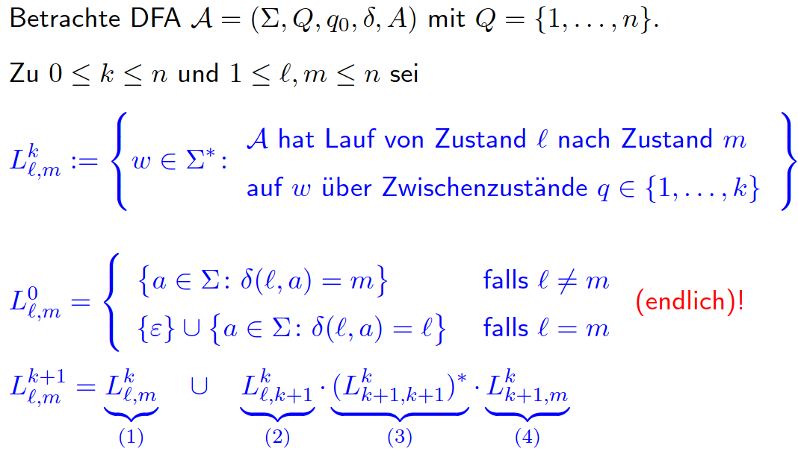

# Vorlesung am 03.12.2021
## Satz von Kleene
$\Sigma$-Sprache $L$ ist von NFA/DFA erkennbar, wenn sie regulär ist.  
(Beweis in Vorlesung)

### Folgerungen
- Klasse regulärer Sprachen unter allen booleschen Operationen, sowie Konkat und Stern, abgeschlossen
- Alle erkennbaren Sprachen lassen sich mit Vereinigung, Konkatenation und Stern aus endlichen Sprachen gewinnen

**Wieviele Zustände sind notwendig?**  
Komplexität von $L$ durch Zustandszahlen von DFA $\mathcal{A}$ mit $L = L(\mathcal{A})$

## Äquivalenzrelation ~
Konstruktion minimalem DFA für $L$:
jeder Zustand beschreibt notwendige Information; verschiedene
Zustände -> notwendige Unterscheidungen.

$\sim_L$ zu $L$: $w \not\sim_L w':$ "notwendige Unterscheidung"  
$\sim_\mathcal{A}$ zu $\mathcal{A}$: $w \not\sim_\mathcal{A} w':$ "verschiedene Berechnungen"

**Äquivalenzrelation $\sim_L$**  
$w \sim_L w'$ gdw $(\forall x \in \Sigma*) (wx \in L \iff w' x \in L)$

- $\sim_L$ ist Äquivalenzrelation auf $\Sigma*$
- $\sim_L$ ist rechts-invariant: $w \sim_L w' \implies wu \sim_L w'u$
- $L$ abgeschlossen unter $\sim_L: w \in L \land w \sim_L w' \to w' \in L$
- $L = \bigcup_{w \in L} [w]\sim_L$

**Bei DFA**  
$w \sim_\mathcal{A} w'$ gdw $\hat\delta(q_0,w) = \hat\delta(q_0,w')$

- $\sim_\mathcal{A}$ ist Äquivalenzrelation auf $\Sigma*$
- $\sim_\mathcal{A}$ ist rechts-invariant: $w \sim_\mathcal{A} w' \implies wu \sim_L w'u$
- $\sim_\mathcal{A}$ hat endlichen Index: $index(\sim_\mathcal{A}) \le |Q|$
- Bei $L = L(\mathcal{A})$ ist $\sim_\mathcal{A}$ Verfeinerung von $\sim_L$:  
  $(\forall w,w' \in \Sigma*) w \sim_\mathcal{A} w' \implies w \sim_L w'$
- Es gilt: $index(\sim_L) \le index(\sim_\mathcal{A}) \le |Q|$

### Zusammenfassung
- $L$ regulär $\implies \sim_L$ hat endlichen Index
- Jeder DFA, der reguläres $L$ erkennt, hat mindestens $index(\sim_L)$ Zustände

## Satz von Myhill-Nerode
- $\sim_L$ hat endlichen Index $\iff$ $L$ regulär
- Für reguläres $L$: DFA mit genau $index(\sim_L)$ Zuständen.
- Eine $\Sigma$-Sprache $L$ ist nicht-regulär, wenn Folge $(w_n)_{n \in \mathbb{N}}$ in $\Sigma*$
gibt mit $w_n \not\sim_L w_m$ für $n \not= m$
