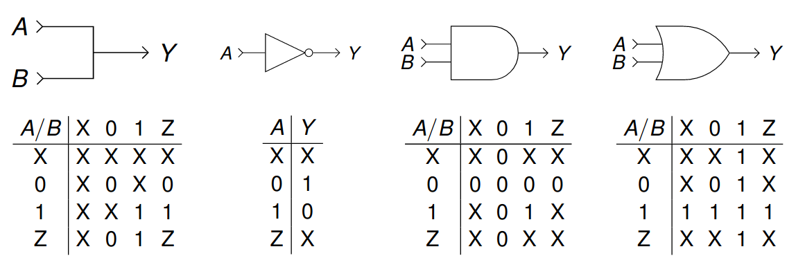
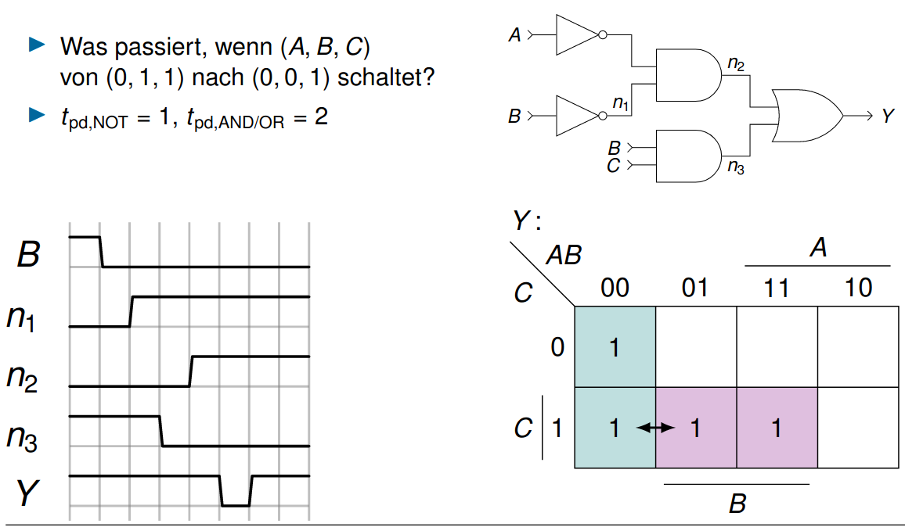

# Vorlesung am 24.11.2021
*Info über 7-Segmentanzeigen ausgelassen.*

## Verfahren zur Logikminimierung
### Algebraisch
Umformen nach Axiomen und Theoremen  
$\implies$ [Bereits besprochen](4_10.11.2021.md)

### Grafisch
KV-Diagramme  
- Für viele Eingänge nicht praktikabel  
- Keine Optimierung zwischen Ausdrücken für mehrere Ausgänge  
$\implies$ [Bereits besprochen](5_17.11.2021.md)

### Algorithmisch
Exakt: Quine-McCluskey  
- Berechnet erst alle Implikanten  
- Rechenzeit steigt exponenziell

Heuristik: Espresso  
- Unterstützt mehrere Eingänge, genaue impl nicht relevant  
- [Download hier](https://ptolemy.berkeley.edu/projects/embedded/pubs/downloads/espresso/)

```espresso
# Y = A xor B
.i 2 # Anzahl Eingänge
.o 1 # Anzahl Ausgänge
.ilb A B # Namen der Eingänge (optional)
.ob Y # Namen der Ausgänge (optional)
.p 4 # Anzahl der Tabellenzeilen (optional)
00 0 # Ausgang 0 optional
01 1
10 1
11 0 # Ausgang 0 optional
.e # Ende (optional)
```


## Mehrwertige Logik
$\mathbb{B} = \{0,1\}$ ignoriert Realität.  
Weitere Werte:  
$X$: Mehrfach getrieben: fehlerhaft  
$Z$: Ungetrieben/hochohmig: gezielt

$Z \not= 0$!!

Konventionen:



## Zeitverhalten kombinatorischer Schaltungen
- Werte am Ausgang nur von Eingangswerten abhängig
- Dennoch Delay in echten Schaltungselementen
- Timinganalyse oft sinnvoll, trotz Schaltzeit in Nanosekunden

### Verzögerungen
$t_{pd}$: maximale Zeit vom Eingang zum Ausgang (Ausbreitungsverzögerung, propagation delay)  
$t_{cd}$: minimale Zeit vom Eingang zum Ausgang (Kontaminationsverzögerung,
contamination delay)

Verzögerung durch Kapazitäten, Induktivitäten und Widerstände in der Schaltung und Lichtgeschwindigkeit (30cm/ns) als Begrenzung verursacht

Unterschied $t_{pd}$ und $t_{cd}$ aufgrund von verschieden langen Pfaden, verschieden lange Lade/Entladezeiten, und Wärme (mehr Hitze = langsamer)

### Pfade

Kritischer Pfad: $t_{pd, Y} = max(...) = 2t_{pd,AND} + t_{pd,OR}$  
Kurzer Pfad: $t_{cd, Y} = min(...) = t_{cd,AND}$


## Störimpulse
- eine Änderung eines Eingangs verursacht mehrere Änderungen des
Ausgangs
- Kann durch Timing- und Karnaugh-Diagramme analysiert werden

### Beispiel


Mit Implikanten $\overline AC$ am OR überdeckbar.