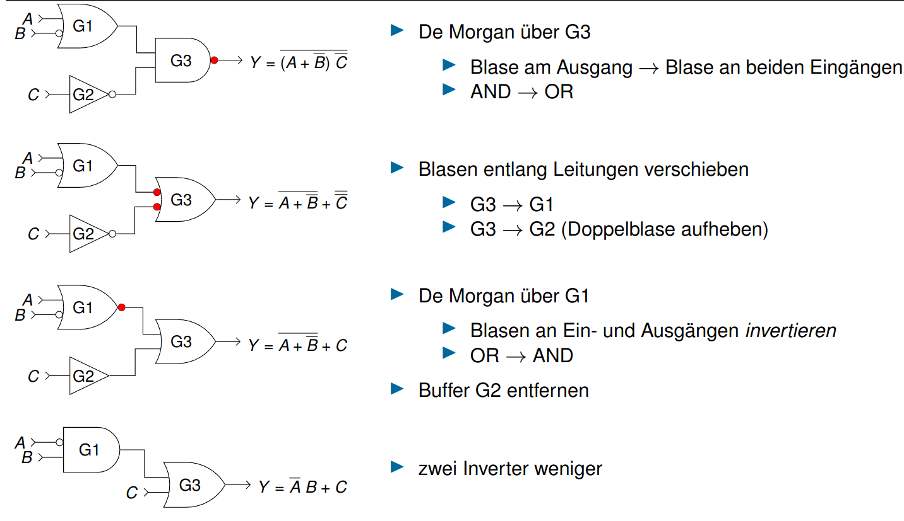
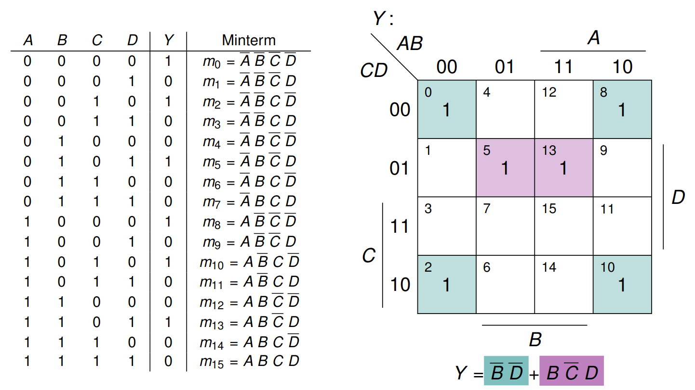

# Vorlesung am 17.11.2021
## Bubble Pushing
Umformen durch verschieben von Invertierungsblasen

Wenn über Gatter hinweg:  
Art des Gatters ändern (AND/OR)  
Blase an allen Eingängen und Ausgang ändern

### Bespiel: rückwärts verschieben

### Anwendung
- Schaltungen vereinfachen
- Komplementäre Schaltung für CMOS  
  zB: $Y = \overline AB + C; \space\space \overline Y = (A + \overline B) \overline C$

## Zweistufige Logik
DNF kann durch Inverter, AND und OR realisiert werden  

Stufe 1: AND für alle Zustände, bei denen Ausgang 1 sein soll 
Stufe 2: OR aller Gatter von Stufe 1

### Konventionen für Schaltpläne
- Eingänge links (oder oben), Ausgänge rechts (oder unten)
- Gatter von links nach rechts (oben nach unten) angeordnet
- gerade (oder rechtwinklige) Verbindungen
- 3-armige Kreuzungen gelten implizit als verbunden
- 4-armige Kreuzungen gelten nur bei Markierung (Punkt) als verbunden

### Beispiel

## Weitere Basisgatter
- XOR: Parität

### Multiplexer
MUX: "Selector"  
$A_0,...,A_{n-1}$ Eingänge  
$S_0,..,S_{k-1}$ Steuersignale ($k = \lceil log_2 n \rceil$)  
Index in $A$, der durch $S$ angegeben wird, wird an Ausgang weitergegeben

Kann zur Logikrealisierung genutzt werden:  
Variablen als Steuersignale  
Konstante an Dateneingängen  
("Lookup Table")

### Dekodierer
DECODE: "Binär zu einzelnen Leitungen"

A1 | A0| Y0| Y1| Y2| Y3
-|-|-|-|-|-
0 | 0 | 1 | 0 | 0 | 0
0 | 1 | 0 | 1 | 0 | 0
1 | 0 | 0 | 0 | 1 | 0
1 | 1 | 0 | 0 | 0 | 1

Logikrealisierung: Summe über Minterme, auf denen Zielfunktion wahr ist  
Somit erste Stufe der zweistufigen Logikrealisierung ersetzt

## Karnaugh/KV-Diagramme
Zusammenhängende Minterme in KV-Diagramm besser erkennbar.  
Somit möglich diese zusammenzufassen

### Minimierungsregeln
Implikant muss Potenz von 2 abdeken  
"Primimplikant": Nicht vergrößerbar

Ablauf:  

- Eintragen von Einsen und Don't Care in Diagramm
- Markieren von Implikanten, die Rechtecke aus 1 oder * formen  
  = Immer so groß wie möglich (Primimplikanten)  
  = Wrapping und Überschneidung erlaubt!  
- Ziel: Überdeckung aller 1 mit wenigen Primimplikanten

