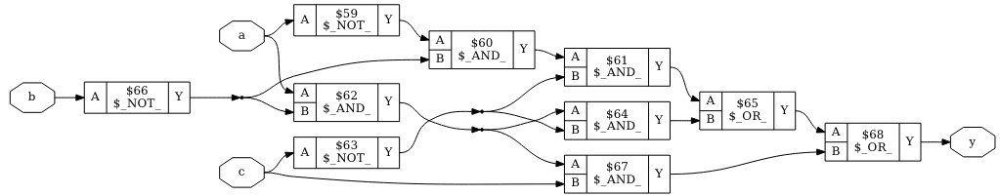

# Vorlesung am 12.01.2022
## Hardwarebeschreibungssprachen
- Aufgrund hoher Komplexität von Systemen benötigt
- Zu Beginn in typischen PLs (Pascal, LISP)
- Später eigene, zB CONLAN, VHDL, Verilog
- Aktuelle Tendenz zu höherer Abstraktion (SystemC, Chisel, BSV), Verilog aus diesen Sprachen erzeugen

## SystemVerilog
### Syntax
- Identifier können nicht mit Digits anfangen
- Whitespace-insensitive, case-sensitive
- Kommentare `//` und `/**/`
- Numerische Literale: `<Bitbreite>'<Basis><Wert>`, Default für ersten beiden `32'd` wenn weggelassen

### Module
- Ähnlich zu Funktion in PLs
- Eingänge, Ausgänge (und Parameter)
- Modul entweder durch Struktur (Aufbau aus Sub-Modulen) oder Verhalten beschrieben
- Hierarchie aus Modulen mit Verhaltensbeschreibung auf unterster Ebene

### Modulbeispiel
```verilog
module example (input logic a, b, c, output logic y);
  assign y = ∼a & ∼b & ∼c | a & ∼b & ∼c | a & ∼b & c;
endmodule
```

- 3 Inputs a,b,c von Datentyp `logic` ('boolean')
- Ausgang `y` wird Logikausdruck zugewiesen (~ = NOT)

### Arbeiten mit Modulen
Simulation mit Icarus Verilog und GTKWave:


Synthese mit YoSyS und GraphViz:


### Modul mit Strukturbeschreibung
```verilog
// Module that ANDs 3 values together and returns the negated result.
module nand3 (input logic d, e, f, output logic w);
  logic s; // Internal variable
  and3 andgate (d, e, f, s); // Instance of module 'and3' named 'andgate'
  inv inverter (s, w); // Instance of module 'inv' named 'inverter'
endmodule
```

- Outputs sind Parameter an Sub-Module (werden nicht wie bei typischen PLs als Rückgabewert gegeben)
- Parameter an Sub-Module können benannt werden, zB wenn `inv` Input `a` und Output `y` hat: `inv inverter (.a (s), .y(w));`

### Datentypen
- `bit`: Zweiwertige Logik
- `logic`: Vierwertige Logik
- `int`: 32bit signed int
- `integer`: 32bit signed logic
- `enum`s
- `time`, `real,` `typedef`, `struct`
- Vektoren: zB `logic [3:0]`: 4-Bit Vektor mit 3 MSB / 0 LSB

### Operatoren
- Operatoren `&, |, ^` können auf `logic` und `logic`-Vektoren angewendet werden
- Können bei Vektoren unär verwendet werden (zB `&a` statt `a[0] & a[1] & a[2]` bei 3-Bit Vektor)
- Ternary: `assign y = s ? d1 : d0`
- Definition interne Variablen: `<type> <name>;`, zB `logic p;`
- Zuweisen von Outputs oder Variablen: `assign p = a;`
- Konkatenation: 
  `// y = a[2] a[1] b[0] b[0] b[0] a[0] 100010`
  `assign y = { a [2:1], {3{b[0]}}, a[0], 6’b100010 };`

### Verzögerungen
```verilog
`timescale 1ns / 10ps // Zeiteinheit angeben

module example_delay (input logic a, b, c, output logic y);
  logic s;
  assign #1 s = a | b; // Verzögert 1 Zeiteinheit
endmodule
```