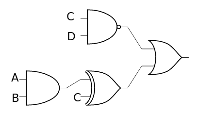
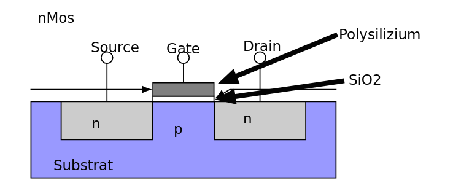

# Übung 3
## 3.1 Zahlendarstellung, Arithmetik, und Bitbreitenerweiterung
### a)
$1100_2 - 10000_2$   
$00001100_2 + 11110000_2 = 11111100_2 = \text{FFC}_{16} = -4_{10}$

### b)
$111_2 - 1_2$  
$00000111_2 + 11111111_2 = 00000110_2 = \text{006}_{16} = 6_{10}$

## 3.2a Logikgatter-Schaltungen

## 3.3 Logikgatter-Substitution
### a)
$\overline A = \overline{A + A}$

### b)
$A' = \overline{A + A}$  
$B' = \overline{A + A}$  
$C = \overline{A' + B'}$

## 3.5 XOR3
### a)
XOR gibt $(x \% 2) == 1$, wenn $x$ die Anzahl der Eingänge, an denen 1 anliegt, an.  
$\rightarrow$ XOR3 = 1, wenn exakt ein Input 1 ist

### b)
1. Kommutativität: Da nur Menge der Inputs, an denen 1 anliegt, betrachtet wird, ist Reihenfolge irrelevant
2. Assoziativität: $(A \oplus B) \oplus C = (A \oplus C) \oplus B$

## 3.6 Transistor Aufbau

- Source/Drain mit n-Typ dottiert, Gate undottiert  
*TODO: Unklar: Funktionsweise, generell mehr zu FETs lesen*

## 3.7
*TODO*