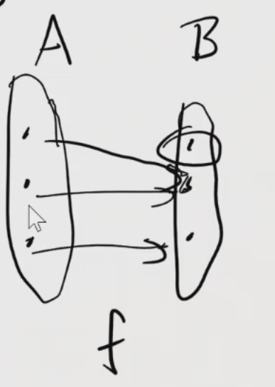

# 1.4 - Abbildungen

## Funktionen
Funktion: $f: A \to B$; weist Element aus A Element aus B zu

$f: A \implies B$ ist ein Tripel $f = (A, B, F)$  
sodass $F \subseteq A × B$ total und rechtseindeutig ist

$dom(f) = A$ - Definitionsbereich  
$cod(f) = B$ - Wertebereich

Für $f: A \to B$ und $a \in A$ bezeichnet $f(a)$ dasjenige $b \in B$, sodass $(a,b) \in graph(f)$  
(graph(f) ist die Relation)

### Beispiele
1. $id_a: A \to A$  
$id_a = (A, A, \{(x,x) | x \in A\})$

2. $f: \mathbb{R} \to \mathbb{R}: x \mapsto x^2$  
   ($f(x) = x^2$)  
   $graph(f) = \{(x,x^2) | x \in \mathbb{R}\}$

3. Dirichletfunktion:  
$f: \mathbb{R} \mapsto \{0,1\}$  
$x \mapsto \begin{cases}
0 & x \in \mathbb{Q} \\
1 & x \not\in \mathbb{Q}
\end{cases}$  
$f(\sqrt{2}) = 1$

4. $g: [0,\infty[ \to [0,\infty[ : x \mapsto \sqrt{x}$  

5. $add: \mathbb{N} × \mathbb{N} \to \mathbb{N}: (x,y) \mapsto x + y$

## Eigenschaften von Funktionen
$f: A \to B$  

- $f$ ist surjektiv, wenn: $\forall y \in B: \exists x \in A: f(x) = y$  
  (Es besteht für alle $y \in B$ ein Wert $x \in A$, für den $f(x) = y$ gilt)

- $f$ injektiv, wenn aus $\forall x,y \in A: f(x) = f(y)$; $x = y$ folgt.

- $f$ ist bijektiv, wenn es surjektiv und injektiv ist.

### Beispiele
  
- Nicht surjektiv, da Element 1 von B fehlt   
- Nicht injektiv, da bei mehreren Elementen $x \in A$ gilt $f(x) = y$

1. $f: \mathbb{R} \to \mathbb{R}: x \mapsto x^2$  
   Nicht S: $1$ und $-1$ auf $1$ abgebildet  
   Nicht I: Negative Werte werden nicht angenommen

2. bijektiv: $g: [0,\infty[ \to [0,\infty[ : x \mapsto \sqrt{x}$

3. ($id_n \not=$) $f: \mathbb{N} \to \mathbb{Z}$;
   $n \mapsto n$  
   inj., $\lnot$surj.

4. $f: \mathbb{R} \to [0,\infty[: x \mapsto x^2$  
   surj., $\lnot$inj. (weil $f(1) = f(-1)$)

## Bijektive Funktionen
$f: A \to B$  

### Umkehrfunktion
$f^{-1}: B \to A: b \mapsto a$ mit $f(a) = b$  
Es besteht für jede bijektive Funktioneine Umkehrfunktion.

### Komposition
$f: A \to B$, $g: B \to C$  
$g \circ f: A \to C: x \mapsto g(f(x))$  

Beispiel: $sin(x^2)$
- $f(x) = x^2$
- $g(x) = sin(x)$
- $\implies g \circ f(x)$

### Satz: $f$ bij.: 
$f^{-1} \circ f = id_A$  
$f \circ f^{-1} = id_B$  
