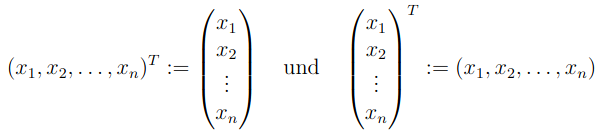

# 3.1 - Vektorräume
Sei $V$ eine Menge und $K$ ein Körper mit Verknüpfungen  
$+: V \times V \to V$ (Vektoraddition)   
$\cdot: K \times V \to V$ (Skalar-Multiplikation)

Dann ist $V$ Vektorraum über $K$, wenn erfüllt ist:  
- V1: $(V, +)$ ist abelsch.  
- V2: $\forall v \in V: 1 \cdot v = v$  
- V3: $\forall v \in V \space \forall \alpha,\beta \in K: (\alpha\beta) \cdot v = \alpha \cdot (\beta \cdot v)$  
- V4: $\forall v \in V \space \forall \alpha,\beta \in K: (\alpha + \beta) \cdot v = \alpha \cdot v + \beta \cdot v$  
- V5: $\forall v,w \in V \space \forall \alpha \in K: \alpha \cdot (v + w) = \alpha \cdot v + \alpha \cdot w$

Das neutrale Element von $(V,+)$ ist der **Nullvektor**.  
Die Elemente des Körpers $K$ werden **Skalare** genannt.

Ist $K = \mathbb{R}$ oder $K = \mathbb{C}$ wird von einem reellen bzw. komplexem Vektorraum gesprochen.

## Beispiel
### Raum K^n
Der Raum $K^n$ der $n$-Tupel:  
$K^n := K \times K \times ... \times K = (x_1, x_2,...,x_n)^T$

Nullvektor: $(0,...,0)^T$

Wenn $K = \mathbb{R}$ ist $\mathbb{R}^n$ der reelle *Standardvektorraum*.

*Achtung*: Vektoren normalerweise vertikal geschrieben; spezielle Notation verwendet:

$x^T$: "x transponiert"

### Raum p x n
Raum der $p \times n$-Matrizen: $K^{p \times n}$  
$p$ Zeilen, $n$ Spalten

### Funktionenräume
$Abb(M,K)$ (alle Funktionen von $M$ nach $K$) ist ein $K$-Vektorraum.

## Satz 3.1.4
1) $\alpha \cdot v = 0_v \iff (\alpha = 0 \lor v = 0_v)$  
2) $(-\alpha) \cdot v = -(\alpha \cdot v)$  
(Beweis im Skript Seite 52)

## Summenschreibweise
Summenschreibweise zur Addition:  
$\displaystyle\sum_{j=3}^{9} 2^j = 2^3 + 2^4 + ... + 2^9$

Ausklammern mit SSW:  
$\displaystyle \alpha \cdot \sum_{k=1}^{n} a_k = \alpha \cdot (a_1 + ... + a_n) = \alpha a_1 + ... + \alpha a_n = \sum_{k=1}^{n} \alpha a_k$