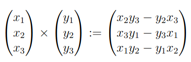

# 3.5 - Geometrie im R^n
*Achtung: Ich war eher demotiviert, als ich diese Notizen geschrieben habe. Sie sind nur auf dem Skript basiert und können Dinge, die in der Vorlesung vorkommen, verpasst haben. You have been warned.*

Dieses Kapitel behandelt Geometrie im Standartvektorraum $\mathbb{R}^n$ mit Standardskalarprodukt.

## Geraden
$g := \{ x + \lambda v : \lambda \in \mathbb{R} \}; v \not= 0$  
Gerade $g$ mit Aufpunkt $x$ und Richtungsvektor $v$.

Geraden können durch 2 Punkte $x,y$ angegeben werden; eindeutig, da einzige Gerade
mit beiden Punkten:  
$g := \{ x + \lambda (y- x) : \lambda \in \mathbb{R} \}; v \not= 0$  
(Beweis Seite 72)

## Ebenen
$E := \{ x + \lambda v + \nu w : \lambda,\nu \in \mathbb{R}$; $v$ und $w$ linear unabhängig  
Ebene $E$ mit Aufpunkt $x$ und Richtungsvektoren $v, w$.

Ebenen können durch 3 Punkte $x,y,z$ angegeben werden (solange diese nicht auf einer gemeinsamen Gerade liegen);
eindeutig, da einzige Ebene mit allen 3 Punkten:  
$E := \{ x + \lambda (y-x) + \nu (z-x) : \lambda,\nu \in \mathbb{R}$

## Hyperebenen
Sei $U$ ein $(n − 1)$-dimensionaler Untervektorraum von $\mathbb{R}^n$ und
$x \in \mathbb{R}^n$. Dann ist der affine Raum $x + U$ eine Hyperebene in $\mathbb{R}^n$

### Beispiel
- Geraden Hyperebenen in $\mathbb{R}^2$
- Ebenen Hyperebenen in $\mathbb{R}^3$

### Satz
Für jede HE $H = x + U$ gibt es einen bis auf Vorzeichen eindeutigen Vektor $v$, mit $||v||_2 = 2$ und
$\forall u \in U: v \bot u$  
Dies ist der Normaleneinheitsvektor von $H$. (Beweis Seite 74)

### Hesse-Normalform
Sei $x_0 \in H$ und $d := (x_0|v)$, dann gilt:  
$H = \{ x \in \mathbb{R}^n: (x|v) = d$  
(Beweis Seite 74/75)

Diese Schreibweise ist die Hesse-Normalform.

Es gilt $dist(x_0, H) = |(x_0|v) - d|$ (Beweis Seite 75)

## Kreuzprodukt

$(x \times y) \bot x, (x \times y) \bot y$.