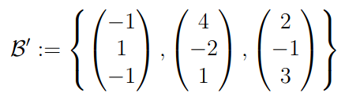
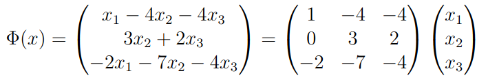

# 3.9 - Basiswechsel

$V$ und $W$ sind endlichdimensionale $K$-Vektorräume mit Basen $\mathcal{B}$ und $\mathcal{B}'$ bzw.
$\mathcal{C}$ und $\mathcal{C}'$. Ist $\Phi: V \to W$ linear, so existieren $T$ und $S$ mit:  
$M_\mathcal{C'}^\mathcal{B'}(\Phi) = TM_\mathcal{C}^\mathcal{B}(\Phi)S$

$V$ ist endlichdimensionaler $K$-Vektorräum mit Basen $\mathcal{B}$ und $\mathcal{B}'$.
Ist $\Phi: V \to V$ linear und $A = M_\mathcal{B}^\mathcal{B}(\Phi)$; $A' = M_\mathcal{B'}^\mathcal{B'}(\Phi)$, so existiert $S$ mit:  
$A' = S^{-1}AS$

Die Matrix S in obigem Satz, die die Abbildungsmatrizen der verschiedenen Basen ineinander übersetzt, ist die Basiswechselmatrix.

## Beispiel
Sei $\mathcal{B}$ die Standardbasis und $\mathcal{B'}$:

Dann ist für die Abbildung

bei der Standardbasis die Abbildungsmatrix:

Da $\mathcal{B}$ die Standardmatrix ist, ist die Basiswechselmatrix analog zu $\mathcal{B'}$:

## Definition
Matrizen $A, B \in K^{n \times n}$ heißen ähnlich, wenn $\exists S \in K^{n \times n}: B = S^{-1}AS$.  
Darstellungsmatrizen einer linearen Abbildung bezüglich verschiedener Basen sind immer zueinander ähnlich.

Sind $B$ und $B'$ Orthonormalbasen eines $n$-dimensionalen $\mathbb{R}$-Vektorraums $V$ mit Skalarprodukt $(\cdot|\cdot)_V$, 
so gilt für die Basiswechselmatrix $S = M_\mathcal{B}^\mathcal{B'}(id) \in \mathbb{R}^{n \times n}, 
dass ihre Spalten eine Orthonormalbasis des $\mathbb{R}^n$ bezüglich des Standardskalarproduktes $(·|·)_{\mathbb{R}^n}$ bilden.

Eine Matrix $A \in \mathbb{R}^{n \times n}$ heißt orthogonal, falls die Spalten von
$A$ eine Orthonormalbasis bezüglich des Standardskalarproduktes bilden.  
Es gilt zusätzlich $A^{−1} = A^T$.

