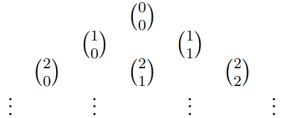

# 5.2 - Wurzeln, Fakultäten und Binomialkoeffizienten
## Potenzen & Wurzeln
Für jedes $a \in \mathbb{R}_+$ und alle $n \in \mathbb{N}^*$ gibt es genau ein $x \in \mathbb{R}_+$
mit $x^n = a$. Diese Zahl $x$ ist die $n$-te Wurzel von $a$ und wird als $x = \sqrt[n]a$ geschrieben.  
Falls $n$ ausgelassen wird, ist $n = 2$ (Quadratwurzel).

Es sei $q = m / n = p / r$ mit  $m, p \in \mathbb{Z}, n, r \in \mathbb{N}^*$. Dann gilt für alle $x$:  
$(\sqrt[n]{x})^m = (\sqrt[r]{x})^p$

Die rationale Potenz ist definiert durch:  
$x^q = x^{n/m} := (\sqrt[m]{x})^n$

**Bemerkung**: Die bekannten Rechenregeln für Potenzen gelten auch für rationale Zahlen größer 0.

## Fakultäten
Engl. Factorial, $n!$ als $n$ Fakultät bezeichnet  
$0! := 1$

### Binominalkoeffizient
$\begin{pmatrix} n \\ k \end{pmatrix} := \frac{n!}{k!(n-k)!}$ ist der Binominalkoeffizient
"$n$ über $k$".

### Eigenschaften
Es seien $n,k \in \mathbb{N}$ mit $k \le n$, und $a,b \in \mathbb{R}$.

- $n!$ ist die Anzahl der möglichen Reihenfolen von $n$ Dingen.
- $\begin{pmatrix} n \\ k \end{pmatrix}$ ist die Anzahl der Möglichkeiten, aus $n$ Dingen $k$ auszuwählen.
- $\begin{pmatrix} n \\ 0 \end{pmatrix} = \begin{pmatrix} n \\ n \end{pmatrix} = 1$
- $\begin{pmatrix} n \\ k \end{pmatrix} + \begin{pmatrix} n \\ k - 1 \end{pmatrix} = \begin{pmatrix} n + 1 \\ k \end{pmatrix}$
- $a^{n+1} - b^{n+1} = (a-b) \sum^n_{k=0} a^{n-k}b^k$
- $(a + b)^n = (a-b) \sum^n_{k=0} \begin{pmatrix} n \\ k \end{pmatrix} a^{n-k}b^k$ (Binomialformel)

### Pascal'she Dreieck
Binomialkoeffizienten lassen sich in einer Pyramide anordnen, um sie leicht zu berechnen.

Das Ausrechnen dieser Pyramide zeigt, dass sich ein Wert immer aus der Summe der 2 Werte über sich
ergibt:

Dies wird das Pascal'she Dreieck genannt.