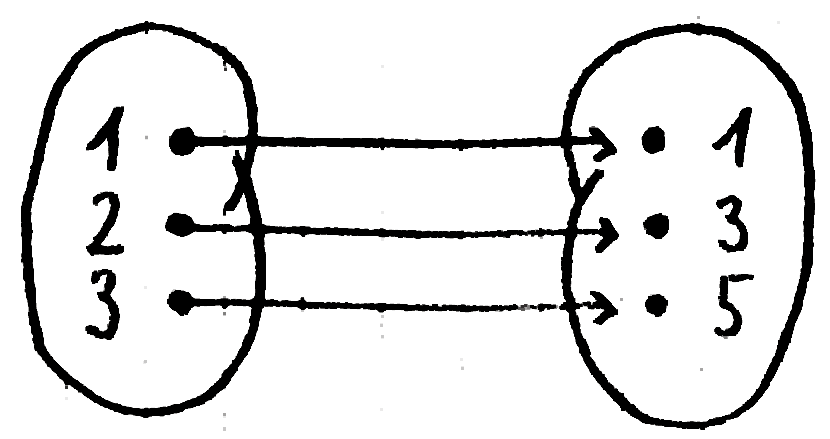

# Funktionen
**Dieses Cheatsheet wurde original von eint Kommiliton*in auf Papier verfasst. Ich habe nur dieses Transskript geschrieben.**

## Schreibweise
Beispiel:  
$f: A \to B: x \mapsto x^2$

- $f, g, h$ = Funktionsname

- $A$ = Definitionsbereich $[dom(f)]$  
 "Werte, die in die Funktion eingesetzt werden dürfen"

- $B$ = Zielmenge $[cod(f)]$ (*NICHT WERTEBEREICH!*)  
  "Mengenangehörigkeit eines Ergebnisses der Funktion"

- $\mapsto$: Definitionspfeil ("maps to", $\LaTeX$: `\mapsto`)

- $x^2$ = Abbildungsvorschrift  
  "Funktionseigenschaft oder Wert. Ermöglicht vereinfachte Schreibweise $f(x) = x^2$

## Eigenschaften
- Surjektivität: $\forall y \in B: \exists x \in A: f(x) = y$  
  "Zu jedem $y$ in der Zielmenge gibt es mindestens 1 $x$ im Definitionsbereich"

- Injektivität: $\forall x,y \in A: f(x) = f(y)$; $x = y$  
  "Zu jedem $y$ und $x$ im Definitionsbereich steht nur ein $x$ zu einem $y$."  
  $\implies$ "Jedes $y$ hat höchstens 1 $x$"

- Bijektivität: surjektiv und injektiv.

([Mehr in Notizen zu 1.4](./../1.%20Grundbegriffe/1.4_abbildungen.md#eigenschaften-von-funktionen))

## Beispiele
$f = \{(1,3), (2,3), (3,2), (4,1) \}$  
- nicht injektiv: 1 & 2 gehen zu 3  
- surjektiv: Alle Werte in $B$ getroffen   
$\implies$ nicht bijektiv

 

$g = \{(1,1), (2,3), (3,5) \}$  
- injektiv: Jedes $y$ hat nur *einen* $x$  
- surjektiv: Alle Werte in $B$ getroffen  
$\implies$ bijektiv

